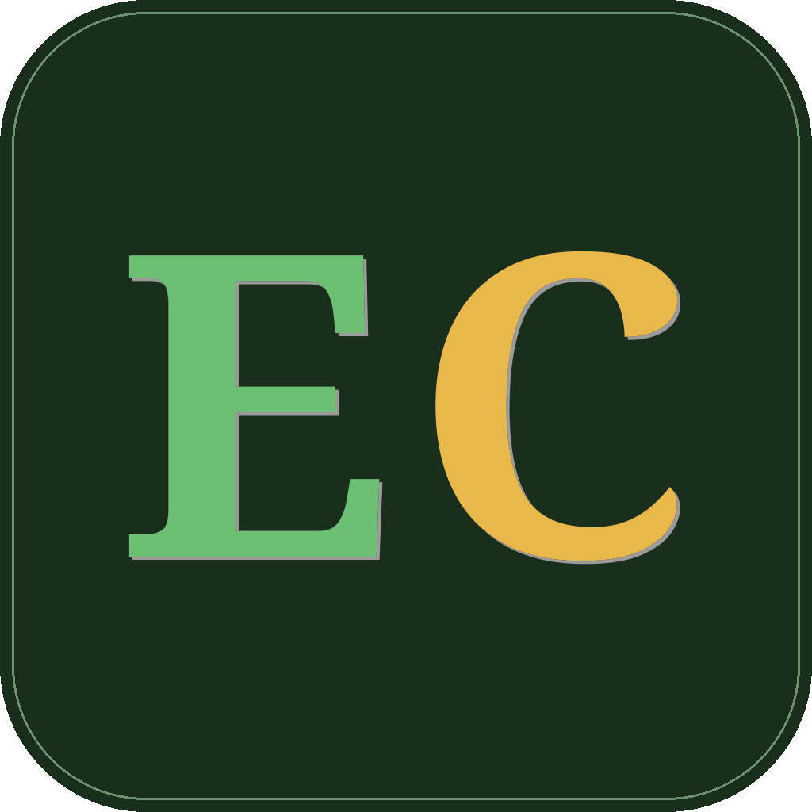

# EloCampo

Marketplace agrícola brasileiro

O `EloCampo` é uma plataforma que visa interligar produtores rurais (agricultura familiar e hortas urbanas/comunitárias) com interessados na compra e consumo da produção, sem atravessadores.

`Análise e Desenvolvimento de Sistemas`

`Projeto: Desenvolvimento de uma Aplicação Distribuída`

`01/2026`

## Integrantes

* [Bruno Figueiredo](https://github.com/Silferveather);
* [Diovane Marcelino Azevedo](https://github.com/diovaneMz);
* [Felipe Miguel Nery Lunkes](https://github.com/felipenlunkes);
* [João Paulo Fernandes Salviano](https://github.com/jpsalviano);
* [Levi Alves](https://github.com/OLeviAlves);
* [Lucas Hermógenes do Nascimento](https://github.com/LucasNascimentoADS);

## Orientador

* Leonardo Vilela Cardoso.

## Acesso

> Aviso! O backend está configurado para funcionar sob demanda. Após um período de inatividade, as aplicações são suspensas. Após a primeira requisição, elas são reiniciadas. Você experienciará um tempo entre a abertura da aplicação mobile ou do login da aplicação web e o estado pronto de ambas as aplicações. O mesmo acontece via requisições diretas ao `Elogateway` (Postman, Imnsonia, etc).

### Backend

O backend pode ser acessado diretamente pelo EloGateway, [neste](https://elogateway.happywave-84e9a5c3.canadacentral.azurecontainerapps.io) link.

### Aplicação Web

O EloCampo pode ser acessado [neste](https://pmv-ads-2026-1-e4-infra-t1-elocampo.onrender.com) link.

### Aplicação mobile frontend

O pacote de instalação da aplicação mobile para Android pode ser encontrada em `src/Artefatos/Android`, ou clicando [aqui](src/Artefatos/Android/EloCampo.apk). Você precisa ter a permissão de instalação de aplicações fora da loja habilitada em seu dispositivo.

## Documentação

<ol>
<li><a href="docs/01-Documentação de Contexto.md">Documentação de contexto</a></li>
<li><a href="docs/02-Especificação do Projeto.md">Especificação do projeto</a></li>
<li><a href="docs/03-Metodologia.md">Metodologia</a></li>
<li><a href="docs/04-Projeto de Interface.md">Projeto de interface</a></li>
<li><a href="docs/05-Arquitetura da Solução.md">Arquitetura da solução</a></li>
<li><a href="docs/06-Template Padrão da Aplicação.md">Template padrão da aplicação</a></li>
<li><a href="docs/07-Programação de Funcionalidades.md">Programação de funcionalidades</a></li>
<li><a href="docs/08-Registro de Testes Unitários.md">Registro de testes unitários</a></li>
<li><a href="docs/09-Registro de Testes de Integração.md">Registro de testes de integração</a></li>
<li><a href="docs/10-Registro de Testes de Sistema.md">Registro de testes de sistema</a></li>
<li><a href="docs/11-Registro de Contribuição.md">Registro de contribuição</a></li>
<li><a href="docs/12-Apresentação do Projeto.md">Apresentação do projeto</a></li>
<li><a href="docs/13-Referências.md">Referências</a></li>
</ol>

## Código

Você pode encontrar o código fonte das aplicações backend, frontend Web e Mobile em `src/`. Clique [aqui](src/README.md) para acessar a documentação.

## Vídeos

Na finalização de cada etapa, temos vídeos gravados por cada integrante descrevendo as contribuições. Estes vídeos podem ser encontrados em `videos/`. Clique [aqui](videos/README.md) para ler a documentação dos vídeos.

<!-- ## Apresentação

<li><a href="presentation/README.md">Apresentação da solução</a></li> -->

