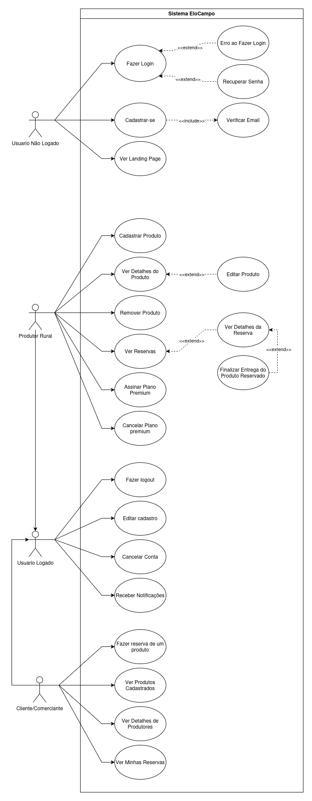
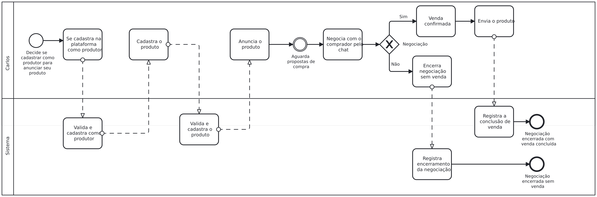
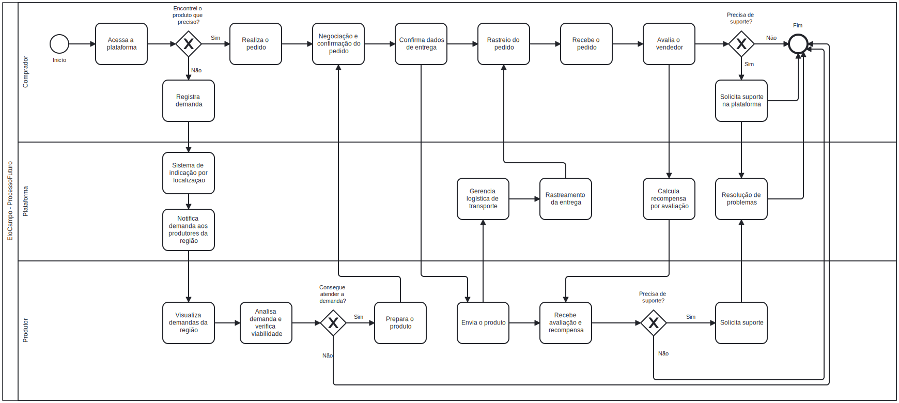
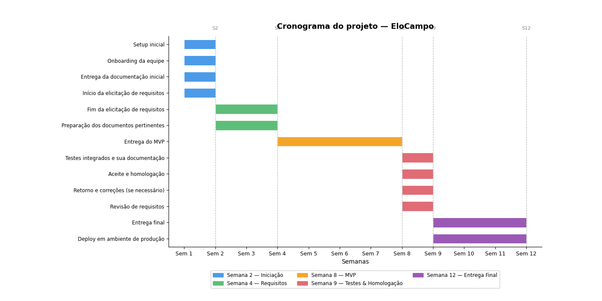

# Especificações do Projeto

<div align="justify">

Esta seção tem como objetivo apresentar de forma estruturada os elementos que compõem a especificação do projeto EloCampo, detalhando os aspectos necessários para compreender o problema identificado, a proposta de solução e os mecanismos utilizados para traduzir essa necessidade em um sistema funcional.

A especificação do projeto busca transformar a ideia inicial apresentada anteriormente em uma estrutura mais organizada e orientada ao desenvolvimento de software. Para isso, serão abordados os principais elementos que auxiliam na compreensão do contexto do problema, nas necessidades dos usuários e nas funcionalidades que deverão compor a solução proposta.

Ao longo desta seção, serão apresentados os processos de levantamento de requisitos, a definição do problema sob a perspectiva dos usuários envolvidos, a modelagem conceitual da solução e a estruturação das funcionalidades que comporão a aplicação. O objetivo é estabelecer uma visão clara do sistema a ser desenvolvido, garantindo que as necessidades dos usuários sejam compreendidas e traduzidas em requisitos concretos.

Nesse sentido, a especificação também busca reduzir ambiguidades, organizar as informações coletadas e servir como referência para as etapas posteriores do desenvolvimento, como modelagem, implementação e testes.

**Técnicas e Ferramentas Utilizadas**

Para a elaboração da especificação do projeto foram utilizadas técnicas de análise de sistemas amplamente adotadas no desenvolvimento de software. Essas técnicas auxiliam na compreensão do problema, na organização das necessidades dos usuários e na definição das funcionalidades da aplicação.

Entre as principais técnicas e ferramentas utilizadas, destacam-se:

_Levantamento de Requisitos_:
Processo utilizado para identificar as necessidades dos usuários, compreender os desafios enfrentados por produtores e consumidores e definir quais funcionalidades a aplicação deverá oferecer para atender essas demandas.

_Análise de Problema e Contexto_:
Método utilizado para compreender o cenário atual da comercialização agrícola, identificando lacunas na conexão entre produtores rurais e consumidores finais.

_Definição de Requisitos Funcionais e Não Funcionais_:
Estruturação das funcionalidades que o sistema deverá possuir, bem como das características de qualidade esperadas para a aplicação, como usabilidade, desempenho, confiabilidade e segurança.

_Diagrama de Casos de Uso_:
Ferramenta utilizada para representar as interações entre os usuários e o sistema, permitindo visualizar como produtores e consumidores utilizarão a plataforma para realizar suas atividades.

**Definição do Problema sob a Perspectiva do Usuário**

A análise do problema proposta neste projeto considera principalmente a perspectiva dos dois principais atores envolvidos na cadeia de comercialização agrícola: o produtor rural e o consumidor final.

Do ponto de vista do produtor rural, especialmente aqueles classificados como pequenos e médios produtores, existe uma dificuldade significativa em acessar diretamente o mercado consumidor. Muitas vezes, esses produtores dependem de intermediários para escoar sua produção, o que pode reduzir suas margens de lucro e limitar sua capacidade de expansão. Além disso, a ausência de canais digitais acessíveis e especializados dificulta a divulgação de seus produtos para novos públicos, restringindo suas oportunidades comerciais.

Outro aspecto relevante é a falta de previsibilidade de demanda, que torna o planejamento produtivo mais incerto. Sem uma visão clara sobre o interesse do mercado, o produtor pode enfrentar tanto excesso de produção quanto perda de oportunidades de venda.

Sob a perspectiva do consumidor final, observa-se um interesse crescente em conhecer melhor a origem dos alimentos consumidos. Muitos consumidores buscam alimentos frescos, produzidos de forma responsável e provenientes de produtores locais. No entanto, mesmo com essa demanda crescente, ainda existem dificuldades para localizar produtores próximos, obter informações confiáveis sobre os processos de cultivo e estabelecer um canal direto de comunicação com quem produz os alimentos.

Dessa forma, tanto produtores quanto consumidores enfrentam desafios que, embora distintos, possuem uma origem comum: a falta de uma plataforma que facilite a conexão direta entre essas duas partes da cadeia produtiva.

**Ideia de Solução**

A partir da análise desse cenário, surge a proposta do EloCampo, uma aplicação digital desenvolvida com o objetivo de aproximar produtores rurais e consumidores finais por meio de uma plataforma que facilite a comunicação, a divulgação de produtos e a realização de negociações.

A solução proposta consiste em um sistema que permitirá aos produtores cadastrar seus produtos, apresentar informações sobre seus métodos de produção e disponibilizar suas ofertas a consumidores interessados. Por sua vez, os consumidores poderão localizar produtores próximos, visualizar os produtos disponíveis, obter informações sobre sua origem e estabelecer contato direto com quem os cultiva.

Além de promover maior visibilidade para os produtores, a plataforma também busca oferecer maior transparência para o consumidor, permitindo que ele conheça melhor os alimentos que consome e os processos envolvidos em sua produção.

Dessa forma, o EloCampo se propõe a atuar como um elo de conexão entre campo e consumidor, contribuindo para reduzir barreiras comerciais, fortalecer a economia local e promover uma relação mais próxima e transparente dentro da cadeia de produção agrícola

## Personas

As personas descritas a seguir foram elaboradas a partir da análise do público-alvo e do problema identificado, representando os perfis de usuários ideais da plataforma EloCampo.

### Persona 1 – Seu Carlos (Produtor Rural de Pequeno Porte)

**Carlos Eduardo de Souza** tem 54 anos, é agricultor familiar em uma pequena propriedade de 12 hectares no interior de Minas Gerais, no município de Divinópolis. Produz hortaliças, legumes e frutas da estação. Casado e pai de dois filhos, Carlos herdou a propriedade do pai e sempre viveu da agricultura. Possui escolaridade até o ensino médio completo e utiliza o smartphone basicamente para WhatsApp e ligações. Sua renda mensal gira em torno de R$ 3.500,00.

**Motivações**: Carlos deseja vender seus produtos sem depender de atravessadores, que ficam com grande parte do lucro. Ele quer alcançar consumidores que valorizem produtos frescos e de qualidade, diretamente da roça.

**Frustrações**: Sente dificuldade em divulgar seus produtos para além da feira local. Não sabe usar plataformas digitais complexas e tem receio de tecnologia. Já perdeu produção por falta de comprador.

**Necessidades**: Uma plataforma simples e intuitiva para cadastrar seus produtos, definir preços e receber pedidos. Precisa de notificações claras quando alguém demonstrar interesse em seus produtos.

---

### Persona 2 – Dona Márcia (Produtora Rural de Médio Porte)

**Márcia Helena Ribeiro** tem 42 anos, é proprietária de uma fazenda de médio porte em São Roque de Minas (MG), onde produz queijos artesanais, doces e laticínios. Possui ensino superior em Administração e já utiliza redes sociais para divulgar seus produtos. É casada, tem três filhos e conta com quatro funcionários na propriedade. Sua renda mensal varia entre R$ 8.000,00 e R$ 15.000,00.

**Motivações**: Márcia quer expandir sua base de clientes para além da região, construir uma marca reconhecida e ter maior previsibilidade de demanda para planejar sua produção com segurança.

**Frustrações**: Mesmo utilizando redes sociais, Márcia tem dificuldade em converter seguidores em compradores recorrentes. Não possui um canal de venda direta estruturado e sente que falta profissionalismo no processo de comercialização.

**Necessidades**: Uma plataforma que permita apresentar seus produtos com fotos e descrições detalhadas, negociar diretamente com compradores e receber avaliações que fortaleçam sua reputação.

---

### Persona 3 – Juliana (Consumidora Consciente)

**Juliana Mendes Costa** tem 31 anos, é nutricionista e mora em Belo Horizonte (MG). Solteira, pratica alimentação saudável e busca alimentos orgânicos e de origem conhecida. Utiliza aplicativos de delivery e compras online com frequência. Sua renda mensal é de R$ 6.500,00.

**Motivações**: Juliana quer saber exatamente de onde vêm os alimentos que consome: quem produz, como produz e quais insumos são utilizados. Valoriza a transparência e o apoio a produtores locais.

**Frustrações**: Tem dificuldade em encontrar produtores rurais próximos que vendam diretamente ao consumidor. Quando encontra, a comunicação costuma ser desorganizada — por WhatsApp, sem catálogo, sem preço definido.

**Necessidades**: Uma plataforma que permita localizar produtores por região, visualizar os produtos disponíveis com informações sobre origem e método de produção, e realizar pedidos de forma prática.

---

### Persona 4 – Roberto (Consumidor Familiar)

**Roberto Alves Pereira** tem 47 anos, é servidor público e mora em Contagem (MG) com a esposa e três filhos. Busca alimentos frescos, mais baratos e de melhor qualidade para a família. Utiliza smartphone no dia a dia, mas prefere interfaces simples. Sua renda mensal é de R$ 5.800,00.

**Motivações**: Roberto quer economizar nas compras do mês comprando diretamente de produtores, sem os custos dos intermediários. Também se preocupa com a qualidade dos alimentos que oferece à família.

**Frustrações**: Não conhece produtores rurais na região e depende exclusivamente de supermercados. Sente que os preços são altos e a qualidade nem sempre é satisfatória.

**Necessidades**: Uma forma fácil de pesquisar e comparar produtos de diferentes produtores, fazer pedidos e acompanhar o status da entrega ou retirada.

---

### Persona 5 – Administrador da Plataforma

**Fernanda Lima** tem 28 anos, é analista de sistemas e faz parte da equipe responsável pela gestão e manutenção da plataforma EloCampo. Possui experiência em suporte técnico e moderação de conteúdo.

**Motivações**: Fernanda quer garantir que a plataforma funcione de forma justa e confiável, com contas verificadas, conteúdos adequados e conflitos resolvidos rapidamente.

**Frustrações**: Em plataformas anteriores em que trabalhou, a ausência de ferramentas de administração eficientes tornava a moderação lenta e ineficaz.

**Necessidades**: Ferramentas administrativas para gerenciar contas de usuários, moderar conteúdos, acompanhar métricas da plataforma e responder a denúncias.

## Histórias de Usuários

Com base na análise das personas foram identificadas as seguintes histórias de usuários, organizadas por contexto:

### Cadastro e Autenticação

<div align="center">

| EU COMO... `PERSONA`           | QUERO/PRECISO ... `FUNCIONALIDADE`                                                             | PARA ... `MOTIVO/VALOR`                                         |
| ------------------------------ | ---------------------------------------------------------------------------------------------- | --------------------------------------------------------------- |
| Produtor rural (Carlos/Márcia) | Me cadastrar na plataforma informando meus dados pessoais, endereço e tipo de conta (vendedor) | Ter acesso à plataforma e começar a divulgar meus produtos      |
| Consumidor (Juliana/Roberto)   | Criar uma conta de comprador com meu nome, e-mail e endereço                                   | Poder buscar e adquirir produtos diretamente de produtores      |
| Usuário cadastrado             | Realizar login com e-mail e senha de forma segura                                              | Acessar minha conta e utilizar as funcionalidades da plataforma |
| Usuário cadastrado             | Recuperar minha senha por e-mail caso a esqueça                                                | Não perder o acesso à minha conta                               |

</div>

### Gestão de Produtos

<div align="center">

| EU COMO... `PERSONA`     | QUERO/PRECISO ... `FUNCIONALIDADE`                                                        | PARA ... `MOTIVO/VALOR`                                              |
| ------------------------ | ----------------------------------------------------------------------------------------- | -------------------------------------------------------------------- |
| Produtor rural (Carlos)  | Cadastrar meus produtos com descrição, unidade de medida, data de disponibilidade e fotos | Que os consumidores possam conhecer o que eu produzo                 |
| Produtora rural (Márcia) | Editar ou remover produtos que cadastrei anteriormente                                    | Manter meu catálogo sempre atualizado com a produção real            |
| Consumidora (Juliana)    | Pesquisar produtos por nome, categoria ou localização do produtor                         | Encontrar alimentos que atendam às minhas preferências e proximidade |

</div>

### Pedidos e Negociação

<div align="center">

| EU COMO... `PERSONA`    | QUERO/PRECISO ... `FUNCIONALIDADE`                               | PARA ... `MOTIVO/VALOR`                                 |
| ----------------------- | ---------------------------------------------------------------- | ------------------------------------------------------- |
| Consumidor (Roberto)    | Criar um pedido selecionando produtos de um produtor             | Formalizar minha intenção de compra de forma organizada |
| Produtor rural (Carlos) | Visualizar os pedidos recebidos e aceitar ou recusar cada um     | Ter controle sobre o que vou vender e para quem         |
| Consumidora (Juliana)   | Acompanhar o status do meu pedido (pendente, aceito, finalizado) | Saber em que etapa está minha compra                    |

</div>

### Comunicação

<div align="center">

| EU COMO... `PERSONA`    | QUERO/PRECISO ... `FUNCIONALIDADE`                                               | PARA ... `MOTIVO/VALOR`                                            |
| ----------------------- | -------------------------------------------------------------------------------- | ------------------------------------------------------------------ |
| Consumidora (Juliana)   | Enviar mensagens diretamente para o produtor dentro da plataforma                | Tirar dúvidas sobre produtos, negociar preços e combinar a entrega |
| Produtor rural (Carlos) | Receber notificações quando um consumidor fizer um pedido ou enviar uma mensagem | Não perder oportunidades de venda por falta de acompanhamento      |

</div>

### Perfil e Avaliação

<div align="center">

| EU COMO... `PERSONA`     | QUERO/PRECISO ... `FUNCIONALIDADE`                | PARA ... `MOTIVO/VALOR`                                    |
| ------------------------ | ------------------------------------------------- | ---------------------------------------------------------- |
| Consumidor (Roberto)     | Avaliar um produtor após a conclusão de um pedido | Ajudar outros consumidores a escolherem bons produtores    |
| Produtora rural (Márcia) | Visualizar as avaliações recebidas no meu perfil  | Entender a percepção dos clientes e melhorar continuamente |

</div>

### Administração

<div align="center">

| EU COMO... `PERSONA`      | QUERO/PRECISO ... `FUNCIONALIDADE`                           | PARA ... `MOTIVO/VALOR`                               |
| ------------------------- | ------------------------------------------------------------ | ----------------------------------------------------- |
| Administradora (Fernanda) | Gerenciar contas de usuários (ativar, desativar, visualizar) | Garantir a integridade e confiabilidade da plataforma |

</div>

## Requisitos

As tabelas que se seguem apresentam os requisitos funcionais e não funcionais que detalham o escopo do projeto. A priorização dos requisitos foi realizada com base na técnica **MoSCoW** (Must have, Should have, Could have, Won't have), considerando o impacto de cada funcionalidade para o MVP e para a experiência dos usuários. Requisitos classificados como **ALTA** prioridade correspondem a funcionalidades essenciais (_Must have_), enquanto requisitos de prioridade **MÉDIA** são importantes mas podem ser entregues em iterações posteriores (_Should have_).

Cada aluno será responsável pela execução completa (back, web e mobile) de pelo menos 2 requisitos, que será acompanhado pelo professor.

### Requisitos Funcionais

<div align="center">

| ID     | Descrição do Requisito                                                                                                                                 | Prioridade | Responsável |
| ------ | ------------------------------------------------------------------------------------------------------------------------------------------------------ | ---------- | ----------- |
| RF-001 | O sistema deve permitir que o usuário crie uma conta (comprador ou vendedor) informando nome, e-mail, senha, CPF/CNPJ, endereço e telefone             | ALTA       | Felipe Lunkes |
| RF-002 | O sistema deve permitir que o usuário realize login com e-mail e senha, recebendo um token de autenticação (JWT)                                       | ALTA       | Felipe Lunkes |
| RF-003 | O sistema deve permitir que o usuário recupere sua senha por meio de um link enviado ao e-mail cadastrado                                              | ALTA       | Felipe Lunkes |
| RF-004 | O sistema deve permitir que o vendedor cadastre produtos com descrição, unidade de medida (kg, unidade, litro etc.), data de disponibilidade e imagens | ALTA       | João Paulo  |
| RF-005 | O sistema deve permitir que o vendedor edite ou remova (exclusão lógica) produtos cadastrados anteriormente                                            | ALTA       | João Paulo  |
| RF-006 | O sistema deve permitir que o comprador pesquise produtos por nome, categoria ou localização (cidade/estado) do produtor                               | ALTA       | Diovane       |
| RF-007 | O sistema deve permitir que o comprador visualize o perfil do vendedor com informações sobre a propriedade, métodos de produção e avaliações recebidas | MÉDIA      | Levi Alves |
| RF-008 | O sistema deve permitir que o comprador crie um pedido selecionando um ou mais produtos de um mesmo vendedor                                           | ALTA       | Diovane |
| RF-009 | O sistema deve permitir que o vendedor visualize os pedidos recebidos e altere o status (aceitar, recusar ou finalizar)                                | ALTA       | Bruno Figueiredo |
| RF-010 | O sistema deve permitir que o comprador acompanhe o status do seu pedido (pendente, aceito, em preparação, finalizado)                                 | ALTA       | Diovane |
| RF-011 | O sistema deve disponibilizar um chat em tempo real entre comprador e vendedor para negociação e esclarecimento de dúvidas                             | ALTA       | Lucas          |
| RF-012 | O sistema deve enviar notificações ao usuário sobre eventos relevantes (novo pedido, mensagem recebida, pedido aceito, pedido finalizado)              | MÉDIA      | Lucas          |
| RF-013 | O sistema deve permitir que o comprador avalie o vendedor com nota (1 a 5 estrelas) e comentário após a finalização de um pedido                       | MÉDIA      | Levi Alves |
| RF-014 | O sistema deve permitir que o administrador gerencie contas de usuários (visualizar, ativar e desativar contas)                                        | MÉDIA      | Bruno Figueiredo |

</div>

### Requisitos não Funcionais

<div align="center">

| ID      | Descrição do Requisito                                                                                                | Prioridade |
| ------- | --------------------------------------------------------------------------------------------------------------------- | ---------- |
| RNF-001 | O aplicativo deve ser compatível com Android 9+ e iOS 14+, rodando em smartphones com no mínimo 2GB de RAM            | ALTA       |
| RNF-002 | O sistema deve responder às requisições do usuário em no máximo 60 segundos em condições normais de rede               | ALTA       |
| RNF-003 | A plataforma deve estar disponível 50% do tempo, com manutenções programadas fora do horário 06h–20h                | ALTA       |
| RNF-004 | O app deve permitir visualização de produtos e conversas sem conexão, sincronizando ao reconectar                     | MÉDIA      |
| RNF-005 | Dados sensíveis (CPF, CNPJ, conta bancária) devem ser criptografados com AES-256 e trafegar via HTTPS/TLS 1.3         | ALTA       |
| RNF-006 | O sistema deve suportar autenticação em dois fatores (2FA) via SMS ou aplicativo autenticador                         | MÉDIA      |
| RNF-007 | A arquitetura backend deve suportar até 1000 usuários simultâneos sem degradação de performance                     | MÉDIA      |
| RNF-008 | A interface deve seguir diretrizes WCAG 2.1 nível AA, com fontes mínimas de 14sp e área de toque de no mínimo 48×48dp | MÉDIA      |
| RNF-009 | Mensagens de negociação devem ser entregues em tempo real com latência máxima de 10 segundo via WebSocket              | ALTA       |
| RNF-010 | A posição do caminhão no rastreamento deve ser atualizada com intervalo máximo de 60 segundos                         | MÉDIA      |
| RNF-011 | O sistema deve estar em conformidade com a LGPD (Lei 13.709/2018), permitindo exclusão e exportação de dados pessoais | ALTA       |
| RNF-012 | O banco de dados deve ter backup automático diário com retenção de 30 dias e recuperação máxima de 4 horas            | BAIXA      |

</div>

## Restrições

<div align="center">

O projeto está restrito pelos itens apresentados na tabela a seguir.

| ID    | Restrição                                                                                                                                               |
| ----- | ------------------------------------------------------------------------------------------------------------------------------------------------------- |
| RE-01 | O projeto deverá ser entregue ao final do semestre letivo, respeitando os marcos definidos no cronograma                                                |
| RE-02 | O backend deve ser desenvolvido utilizando a linguagem C# com os frameworks definidos na arquitetura da solução, sem substituição por outras linguagens |
| RE-03 | O banco de dados deve utilizar exclusivamente o MongoDB como gerenciador, conforme definido na arquitetura do projeto                                   |
| RE-04 | A aplicação mobile deve ser desenvolvida em React Native e a aplicação web em React, conforme as tecnologias definidas pela equipe                      |

</div>

## Matriz de Rastreabilidade

<div align="center">

| ID     | Descrição do Requisito Funcional                                                                                                                       | Prioridade | Impacta RNF(s)            | Impacta RF(s)          |
| ------ | ------------------------------------------------------------------------------------------------------------------------------------------------------ | ---------- | ------------------------- | ---------------------- |
| RF-001 | O sistema deve permitir que o usuário crie uma conta (comprador ou vendedor) informando nome, e-mail, senha, CPF/CNPJ, endereço e telefone             | ALTA       | RNF-005, RNF-011          | RF-002, RF-003         |
| RF-002 | O sistema deve permitir que o usuário realize login com e-mail e senha, recebendo um token de autenticação (JWT)                                       | ALTA       | RNF-002, RNF-006          | RF-003, RF-008, RF-011 |
| RF-003 | O sistema deve permitir que o usuário recupere sua senha por meio de um link enviado ao e-mail cadastrado                                              | ALTA       | RNF-002                   | -                      |
| RF-004 | O sistema deve permitir que o vendedor cadastre produtos com descrição, unidade de medida (kg, unidade, litro etc.), data de disponibilidade e imagens | MÉDIA      | RNF-002                   | RF-005, RF-006, RF-007 |
| RF-005 | O sistema deve permitir que o vendedor edite ou remova (exclusão lógica) produtos cadastrados anteriormente                                            | ALTA       | RNF-002                   | RF-006, RF-007         |
| RF-006 | O sistema deve permitir que o comprador pesquise produtos por nome, categoria ou localização (cidade/estado) do produtor                               | ALTA       | RNF-002                   | RF-002, RF-004         |
| RF-007 | O sistema deve permitir que o comprador visualize o perfil do vendedor com informações sobre a propriedade, métodos de produção e avaliações recebidas | ALTA       | RNF-002                   | RF-013                 |
| RF-008 | O sistema deve permitir que o comprador crie um pedido selecionando um ou mais produtos de um mesmo vendedor                                           | ALTA       | RNF-002, RNF-009          | RF-009, RF-010         |
| RF-009 | O sistema deve permitir que o vendedor visualize os pedidos recebidos e altere o status (aceitar, recusar ou finalizar)                                | ALTA       | RNF-002                   | RF-010, RF-012         |
| RF-010 | O sistema deve permitir que o comprador acompanhe o status do seu pedido (pendente, aceito, em preparação, finalizado)                                 | MÉDIA      | RNF-002                   | RF-012                 |
| RF-011 | O sistema deve disponibilizar um chat em tempo real entre comprador e vendedor para negociação e esclarecimento de dúvidas                             | MÉDIA      | RNF-002, RNF-009          | RF-012                 |
| RF-012 | O sistema deve enviar notificações ao usuário sobre eventos relevantes (novo pedido, mensagem recebida, pedido aceito, pedido finalizado)              | ALTA       | RNF-002                   | -                      |
| RF-013 | O sistema deve permitir que o comprador avalie o vendedor com nota (1 a 5 estrelas) e comentário após a finalização de um pedido                       | ALTA       | RNF-002                   | RF-010                 |
| RF-014 | O sistema deve permitir que o administrador gerencie contas de usuários (visualizar, ativar e desativar contas)                                        | BAIXA      | RNF-002, RNF-005, RNF-011 | RF-002                 |

</div>

## Diagrama de Casos de Uso

Abaixo, o diagrama de casos de uso da plataforma (figura 1).

<div align="center">



Figura 1: Diagrama de casos de uso

</div>

## Processos Organizacionais

<div>

### Processos Atuais

---

### Analise do processo atual da agricultura familiar

Com base nas personas identificadas (Seu Carlos, Dona Márcia, Juliana, Roberto e Administrador), foi mapeado o processo atual de comercio facilitado de alimentos produzido por pequenos agricultores pela plataforma EloCampo, identificando os principais pontos de dor e oportunidades de melhoria.

### Processo Atual - Situação Problemática

Produtores da agricultura familiar enfrentam baixa visibilidade, pouca presença digital e negociações descentralizadas. A dependência de intermediários reduz lucros, enquanto a oscilação de demanda gera desperdícios ou falta de produtos. Esses fatores limitam o crescimento, dificultam o acesso a novos mercados e reduzem a eficiência das vendas.

### Principais Problemas Identificados

**Dificuldade de divulgação**: Muitos produtores tem dificuldade de divulgar seus produtos devido a falta de visibilidade, tempo e esforço necessário para desenvolver uma rede social sólida para divulgação dos produtos.

**Baixa Presença Digital**: Muitos produtores não possuem conhecimento ou ferramentas para vender online, limitando o alcance dos seus produtos

**Negociação Descentralizada**: Negociações ocorrem de varias formas: WhatsApp, ligações ou feiras, sem registro ou lista de pedidos

**Oscilação de Demanda**: Dificuldade em prever demanda, resultando em desperdício ou falta de produtos.

**Dependência de Intermediários**: Agricultores frequentemente vendem para atravessadores, reduzindo sua margem de lucro e perdendo o controle sobre os preços

---

### Oportunidades de Melhoria Identificadas

**Plataforma de Divulgação Integrada:** Criar um marketplace onde os produtores possam cadastrar seus produtos de forma simples, com fotos, descrições e preços, eliminando a necessidade de manter redes sociais separadas.

**Capacitação e Interface Simplificada:** Desenvolver uma interface intuitiva e acessível, permitindo que produtores com pouca experiência digital consigam vender online facilmente.

**Centralização das Negociações:** Implementar um sistema interno de pedidos e mensagens, substituindo negociações dispersas (WhatsApp, ligações), garantindo organização e histórico das vendas.

**Venda Direta ao Consumidor (D2C):** Permitir que produtores vendam diretamente ao cliente final, reduzindo ou eliminando intermediários e aumentando sua margem de lucro.

**Sistema de Reputação e Avaliações:** Criar um sistema de avaliações para gerar confiança entre produtores e consumidores, incentivando boas práticas e transparência.

**Notificações Inteligentes:** Alertar produtores sobre novas demandas, produtos em alta ou baixo estoque, facilitando a tomada de decisão rápida.

**Gestão de Estoque Simplificada:** Ferramenta básica para controle de produção disponível, evitando vendas de produtos indisponíveis.




### Processos Futuros

---

O Elocampo foi concebido com o propósito de promover uma comunicação mais eficiente, direta e confiável entre o produtor e o consumidor final. Como visão de evolução futura, espera-se consolidar cada vez mais essa ponte, oferecendo aos usuários uma plataforma mais completa, robusta e integrada no que diz respeito à relação entre vendedor e comprador.

Nesse sentido, algumas frentes de aprimoramento são vistas como estratégicas para a expansão do projeto.

**1. Logística de transporte**

Uma das evoluções previstas para a plataforma é a implementação de um módulo voltado à logística de transporte, permitindo não apenas o acompanhamento das entregas, mas também uma gestão mais ampla de toda a cadeia logística envolvida na comercialização dos produtos.

-Entre as possibilidades previstas, destacam-se:

.Criação e gerenciamento da logística de transporte dentro da própria plataforma; <br>
.Oferta de uma opção de fretamento interno ao vendedor; <br>
.Disponibilização, ao comprador, de uma visão mais completa sobre o processo de entrega do produto solicitado, garantindo maior transparência e previsibilidade. <br>


**2. Criação de pedidos por parte do comprador**

Outra funcionalidade importante para a evolução do sistema é permitir que o comprador possa registrar demandas mesmo na ausência de uma oferta previamente anunciada na plataforma.

-Entre as possibilidades previstas, destacam-se:

.O comprador informe sua necessidade de determinado produto, ainda que ele não esteja anunciado; <br>
.O vendedor possa visualizar essas demandas e, a partir disso, suprir a necessidade apresentada; <br>
.Também seja possível ao vendedor indicar alternativas ou encaminhamentos ao comprador, ampliando as chances de negociação e atendimento. <br>

Essa funcionalidade torna a plataforma mais dinâmica, pois deixa de depender exclusivamente de anúncios ativos e passa a considerar também as necessidades manifestadas diretamente pelos compradores.

**3. Sistema de indicação e localização**

Como forma de aprimorar a experiência de uso da plataforma, também se prevê a implementação de um sistema de indicação, voltado especialmente para facilitar a localização entre oferta e demanda em regiões próximas.

-Entre as possibilidades previstas, destacam-se:

.Maior facilidade para que o comprador descubra produtores próximos à sua localidade; <br>
.Melhor visualização, por parte do vendedor, das demandas existentes em sua área de atuação; <br>
.Fortalecimento da conexão regional entre produtores e consumidores, reduzindo distâncias e favorecendo negociações mais acessíveis. <br>


**4. Sistema de recompensas por avaliação**

Outra possibilidade de expansão é a criação de um sistema de recompensas baseado em avaliações. Esse mecanismo poderá incentivar a participação ativa dos usuários, valorizando boas práticas dentro da plataforma.

-Entre as possibilidades previstas, destacam-se:

.Aumento da confiança entre compradores e vendedores; <br>
.Incentivo à boa conduta e à qualidade no atendimento; <br>
.Fortalecimento da credibilidade da plataforma como ambiente de negociação. <br>

**5. Suporte para vendedor e comprador**

Por fim, também se destaca a importância da implementação de uma estrutura de suporte ao vendedor e ao comprador, oferecendo auxílio durante o uso da plataforma e contribuindo para a resolução de dúvidas, problemas operacionais e eventuais conflitos.
Esse suporte tende a ser fundamental para melhorar a experiência do usuário, aumentar a confiança no sistema e garantir maior segurança nas interações realizadas dentro da plataforma.

### Conclusão Processos Futuros

A evolução futura do Elocampo demonstra que a plataforma possui potencial para ir além de um ambiente de intermediação entre produtor e consumidor. A proposta é que, com o tempo, ela se torne um ecossistema mais completo, capaz de atender diferentes etapas da jornada de compra e venda, desde a manifestação da demanda até a entrega do produto, passando por localização, negociação, avaliação e suporte.

Dessa forma, o projeto reforça seu objetivo principal de estreitar o elo entre vendedor e comprador, promovendo uma experiência cada vez mais eficiente, transparente e funcional para todos os envolvidos.



---
</div>


## Gerenciamento de Projeto

A metodologia `Scrum` foi selecionada pois sua gestão de projetos ágil que tem como objetivo aumentar a produtividade e a qualidade do trabalho desenvolvido. Ela é baseada em três pilares: **transparência**, **inspeção** e **adaptação**.

### Cronogramas e marcos

O projeto terá duração aproximada de **12 semanas**, conforme o diagrama de Gantt disponível abaixo (figura 2).

<div align="center">



Figura 2: Diagrama de Gantt.

</div>

Desta forma, foram definidos os seguintes marcos:

- Semana 2:
  - Setup inicial;
  - Onboarding da equipe;
  - Entrega da documentação inicial;
  - Início da elicitação de requisitos;
- Semana 4:
  - Fim da elicitação de requisitos;
  - Preparação dos documentos pertinentes;
- Semana 8:
  - Entrega do MVP;
- Semana 9:
  - Testes integrados e sua documentação;
  - Aceite e homologação;
  - Retorno e correções (caso necessário);
  - Revisão de requisitos;
- Semana 12:
  - Entrega final;
  - Deploy em ambiente de produção.

#### Código para geração do diagrama

Foi desenvolvido um script em Python para geração de um diagrama visual. Ele está disponível abaixo. Este script foi executado com sucesso no Python 3.13.7 no Ubuntu 25.10.

```python
import matplotlib.pyplot as plt
import matplotlib.patches as mpatches

tasks = [
    # (nome, semana_inicio, semana_fim, cor)
    ("Setup inicial",                         1, 2,  "#4C9BE8"),
    ("Onboarding da equipe",                  1, 2,  "#4C9BE8"),
    ("Entrega da documentação inicial",       1, 2,  "#4C9BE8"),
    ("Início da elicitação de requisitos",    1, 2,  "#4C9BE8"),
    ("Fim da elicitação de requisitos",       2, 4,  "#5DBE7A"),
    ("Preparação dos documentos pertinentes", 2, 4,  "#5DBE7A"),
    ("Entrega do MVP",                        4, 8,  "#F4A62A"),
    ("Testes integrados e sua documentação",  8, 9,  "#E06C75"),
    ("Aceite e homologação",                  8, 9,  "#E06C75"),
    ("Retorno e correções (se necessário)",   8, 9,  "#E06C75"),
    ("Revisão de requisitos",                 8, 9,  "#E06C75"),
    ("Entrega final",                         9, 12, "#9B59B6"),
    ("Deploy em ambiente de produção",        9, 12, "#9B59B6"),
]

n = len(tasks)
fig, ax = plt.subplots(figsize=(14, 7))
fig.subplots_adjust(left=0.28, bottom=0.18)

for i, (name, start, end, color) in enumerate(tasks):
    y = n - 1 - i
    ax.barh(y, end - start, left=start, height=0.6, color=color, edgecolor="white", linewidth=0.8)

# Linhas de marco
milestones = [2, 4, 8, 9, 12]
for m in milestones:
    ax.axvline(x=m, color="gray", linestyle="--", linewidth=0.8, alpha=0.6)
    ax.text(m, n - 0.1, f"S{m}", ha="center", fontsize=8, color="gray")

# Rótulos no eixo Y (nomes das tarefas)
ax.set_yticks(range(n))
ax.set_yticklabels([name for name, *_ in reversed(tasks)], fontsize=8.5)
ax.set_xticks(range(1, 13))
ax.set_xticklabels([f"Sem {i}" for i in range(1, 13)], fontsize=9)
ax.set_xlim(0.5, 12.5)
ax.set_ylim(-0.5, n - 0.5)
ax.set_xlabel("Semanas", fontsize=10)
ax.set_title("Cronograma do projeto — EloCampo", fontsize=13, fontweight="bold", pad=12)

legend_items = [
    mpatches.Patch(color="#4C9BE8", label="Semana 2 — Iniciação"),
    mpatches.Patch(color="#5DBE7A", label="Semana 4 — Requisitos"),
    mpatches.Patch(color="#F4A62A", label="Semana 8 — MVP"),
    mpatches.Patch(color="#E06C75", label="Semana 9 — Testes & Homologação"),
    mpatches.Patch(color="#9B59B6", label="Semana 12 — Entrega Final"),
]
ax.legend(handles=legend_items, loc="upper center", bbox_to_anchor=(0.5, -0.1),
          ncol=3, fontsize=8.5, framealpha=0.9)

ax.spines["top"].set_visible(False)
ax.spines["right"].set_visible(False)

plt.savefig("gantt.png", dpi=150, bbox_inches="tight")
plt.show()
print("Salvo em gantt.png")
```

### Estimativa de custos

Para a estimativa de custos, foram considerados os seguintes fatores:

- **Equipe de desenvolvimento**: inclui senioridade e tempo de dedicação exclusiva);
- **Infraestrutura**: hospedagem, bancos de dados, CI/CD e plataformas utiizadas pela aplicação, como mensageria;
- **Ferramentas de apoio**: licenças se software e monitoramento (como Datadog) e colaboração, como Microsoft Teams;
- **Contingência**: valor utilizado como margem de segurança para cobrir mudanças no andamento do desenvolvimento do projeto.

### Plano de recursos

Considere as tabelas abaixo com os dados de estimativa de custos proposta para o andamento do projeto (tabelas 1-5).

<div align="center">

Tabela 1: Matriz de competências (Skills Matrix)

|                 Recurso (pessoa)                 | Backend | Frontend | UX/UI | DevOps | QA/Aceite | Project Owner |                                         Observações                                         |
| :----------------------------------------------: | :-----: | :------: | :---: | :----: | :-------: | :-----------: | :-----------------------------------------------------------------------------------------: |
|        Desenvolvedor 1 (Bruno Figueiredo)        |    x    |          |       |        |           |               |                                    Desenvoledor backend                                     |
|       Desenvolvedor 2 (Diovane Marcelino)        |    x    |    x     |   x   |        |           |               |                                Desenvolvedor frontend; UX/UI                                |
|   Desenvolvedor 3 (Felipe Miguel Nery Lunkes)    |    x    |          |       |   x    |           |               | Desenvolver backend Java, Rust e C# com experiência em arquitetura de soluções distribuídas |
|      Desenvolvedor 4 (João Paulo Salviano)       |    x    |    x     |       |        |     x     |       x       |            Project Owner atuando como desenvolvedor frontend; realiza os aceites            |
|           Desenvolvedor 5 (Levi Alves)           |    x    |    x     |       |        |           |               |                                   Desenvolvedor fullstack                                   |
| Desenvolvedor 6 (Lucas Hermógenes do Nascimento) |    x    |    x     |       |        |           |               |                                   Desenvolvedor fullstack                                   |

Tabela 2: Alocação por Sprints

|      Sprint       |                                                        Atividade                                                         | Recurso A (desenvolvedor 1) | Recurso B (desenvolvedor 2) | Recurso C (desenvolvedor 3) | Recurso D (desenvolvedor 4) | Recurso E (desenvolvedor 5) | Recurso F (desenvolvedor 6) |
| :---------------: | :----------------------------------------------------------------------------------------------------------------------: | :-------------------------: | :-------------------------: | :-------------------------: | :-------------------------: | :-------------------------: | :-------------------------: |
|  1 (semanas 1-2)  |                                         Planejamento e elicitação de requisitos                                          |             40h             |             40h             |             40h             |             40h             |             40h             |             40h             |
|  2 (semanas 3-4)  |                                         Finalização da elicitação de requisitos                                          |             40h             |             40h             |             40h             |             40h             |             40h             |             40h             |
|  3 (semanas 5-6)  |                                   Desenvolvimento das aplicações web backend e mobile                                    |             40h             |             40h             |             40h             |             40h             |             40h             |             40h             |
|  4 (semanas 7-8)  |                           Desenvolvimento das aplicações web backend e mobile; Entrega do MVP                            |             40h             |             40h             |             40h             |             40h             |             40h             |             40h             |
| 5 (semanas 9-10)  | Integração dos demais requisitos; Testes de aceite e homologação; Correções de retorno; Testes unitários e de integração |             40h             |             40h             |             40h             |             40h             |             40h             |             40h             |
| 6 (semanas 11-12) |                                    Homologação final e deploy no ambiente de produção                                    |             40h             |             40h             |             40h             |             40h             |             40h             |             40h             |

Tabela 3: Custos estimados para a equipe

| Recurso (pessoa) | Senioridade | Custo mensal (R$) | Custo total (R$) | Total acumulado (R$) |
| :--------------: | :---------: | :---------------: | :--------------: | :------------------: |
| Desenvolvedor 1  |   Júnior    |     5.000,00      |    15.000,00     |      15.000,00       |
| Desenvolvedor 2  |   Júnior    |     5.000,00      |    15.000,00     |      30.000,00       |
| Desenvolvedor 3  |   Sênior    |     12.000,00     |    36.000,00     |      66.000,00       |
| Desenvolvedor 4  |   Júnior    |     5.000,00      |    15.000,00     |      81.000,00       |
| Desenvolvedor 5  |   Júnior    |     5.000,00      |    15.000,00     |      96.000,00       |
| Desenvolvedor 6  |   Júnior    |     5.000,00      |    15.000,00     |      111.000,00      |

Tabela 4: Custos estimados para a infraestrutura, serviços e reserva

|                    Recurso                    | Custo mensal unitário (USS$) | Custo total (USS$) | Total acumulado (USS$) |
| :-------------------------------------------: | :--------------------------: | :----------------: | :--------------------: |
| Microsoft Azure (ambiente de desenvolvimento) |            250,00            |      1.000,00      |        1.000,00        |
|    Microsoft Azure (ambiente de produção)     |            500,00            |      5.000,00      |         6.000          |
|       Licença do Microsoft Windows (x4)       |            150,00            |       600,00       |        6.600,00        |
|                    Reserva                    |           5.000,00           |     15.000,000     |       21.600,00        |

Tabela 5 : Dependências críticas

| Identificador | Atividade                                                     |                  Dependência                  |                     Responsáveis                     |        Risco estipulado         |
| :-----------: | :------------------------------------------------------------ | :-------------------------------------------: | :--------------------------------------------------: | :-----------------------------: |
|       1       | Setup inicial; onboarding da equipe; elicitação de requisitos |                    Não há                     |                    Project Owner                     |     Afeta todas as sprints      |
|       2       | Configuração da infraestrutura e elicitação de requisitos     |                     ID-2                      |                        DevOps                        | Afeta a sprint atual e próximas |
|       3       | Desenvolvimento da aplicação web backend                      |                     ID-2                      |         Desenvolvedores backend e fullstack          | Afeta a sprint atual e próximas |
|       4       | Desenvolvimento da aplicação web                              |                  ID-2; ID-3                   | Desenvolvedores backend, frontend, fullstack e UX/UI | Afeta a sprint atual e próximas |
|       5       | Desenvolvimento da aplicação mobile (React Native)            |                  ID-2; ID-3                   |     Desenvolvedores frontend, fullstack e UX/UI      | Afeta a sprint atual e próximas |
|       6       | Aceites iniciais, homologação e testes de integração          |            ID-2; ID-3; ID-4; ID-5             |        Todos os desenvolvores e Project Owner        | Afeta a sprint atual e próximas |
|       7       | Entrega do MVP                                                |         ID-2; ID-3; ID-4; ID-5; ID-6          |                    Project Owner                     |  Afeta sprint atual e próximas  |
|       8       | Correções solicitadas pelo cliente; homologação final         |      ID-2; ID-3; ID-4; ID-5; ID-6; ID-7       |            Afeta a entrega final (deploy)            |
|       9       | Deploy final da solução em ambiente de produção               | ID-1; ID-2; ID3; ID-4; ID-5; ID-6; ID-7; ID-8 |            Afeta e entrega final (deploy)            |

</div>

### Análise de riscos

Uma análise inicial de riscos foi conduzida, e será conduzida após cada marco estipulado no cronograma do projeto. Foram incluidos marcadores que devem ser utilizados para indicar possíveis ameaças ao andamento do projeto em seu cronograma e previsão de custos:

- **Riscos técnicos**:
  - Desempenho abaixo do esperado;
  - falha na integração dos requisitos levantados;
  - Escalabilidade abaixo do esperado, o que indica que a plataforma pode não suportar a demanda;
- **Riscos de cronograma (prazos e marcos**):
  - Atrasos nas entregas;
  - Atrasos na alocação de recursos de infraestrutura;
- **Riscos de equipe**:
  - Baixo rendimento ou afastamento na equipe de desenvolvimento ou afastamentos (ausência, baixa participação, licença, etc);
  - Alta curva de aprendizado para as tecnologias utilizadas (entenda-se linguagens de programação, frameworks, gerenciadores de base de dados e sistemas operacionais, como Linux, Windows ou Android);
- **Planos de mitigação**:
  - Testes contínuos de aceite e mitigação;
  - Reserva de recursos financeiros para cobrir gastos inesperados de infraestrutura ou contratação;

### Divisão de papéis da equipe

A equipe utiliza o Scrum como base para definição do processo de desenvolvimento.

- **Scrum Master**: Felipe Miguel Nery Lunkes;
- **Product Owner**: João Paulo Fernandes Salviano;
- **Arquiteto de software**: Felipe Miguel Nery Lunkes;
- **Equipe de desenvolvimento**:
  - Bruno Figueiredo;
  - Diovane Marcelino Azevedo;
  - Felipe Miguel Nery Lunkes;
  - João Paulo Fernandes Salviano;
  - Levi Alves;
  - Lucas Hermógenes do Nascimento.

</div>
