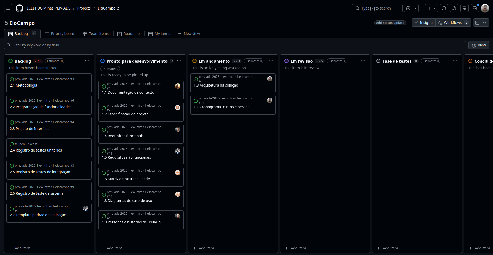

# Metodologia

<div align="justify">

A seguir, detalhes do ambiente de desenvolvimento e estrutura selecionados para o projeto.

## Ambiente de trabalho

Nesta seção, mais informações sobre o ambiente de desenvolvimento local para a aplicação, incluindo IDEs e demais ferramentas.

### Ambiente de desenvolvimento backend

Para o desenvolvimento da aplicação, foram selecionadas as seguintes IDEs (_Integrated Development Environment_ - Ambientes de Desenvolvimento Integrado):

- [**JetBrains IntelliJ**](https://www.jetbrains.com/pt-br/idea/) (versão 2026.1), para uso em ambientes Linux e Windows;
- [**Visual Studio Code**](https://visualstudio.microsoft.com/pt-br/#vscode-section) (versão 1.113.0), para uso em ambientes Linux e Windows;

Visando proporcionar um ambiente **multiplataforma** para o desenvolvimento, foram selecionadas duas IDEs, permitindo o desenvolvimento em sistemas baseados em Windows e em sistemas Linux.

### Ambiente de desenvolvimento frontend

#### [**Visual Studio Code**](https://visualstudio.microsoft.com/pt-br/#vscode-section)

O Visual Studio Code será utilizado, principalmente, para a edição de configurações, bem como construção de contratos [Swagger](https://swagger.io/). **Será utilizada a última versão estável disponível**.

#### [**Android Studio**](https://developer.android.com/studio?hl=pt-br)

O Android Studio será a IDE utilizada para o desenvolvimento da aplicação, sua execução e depuração, bem como gerar os binários e artefatos necessários para a execução no dispositivo alvo (gerar o arquivo APK de instalação para dispositivos Android). **Será utilizada a última versão estável disponível** (2025.1.3.7).

#### Configuração do ambiente de desenvolvimento frontend

##### Versões de software

- **Node.js:** v22.17.0;
- **React Native CLI:** 20.0.0;
- **Android Studio:** (2025.1.3.7);
- **Visual Studio Code:** (recomendado, versão mais recente).

##### Passos para Instalação

1.  **Instale o Node.js**: Baixe e instale a versão LTS do [Node.js](https://nodejs.org/);
2.  **Instale o Java Development Kit (JDK)**: O React Native requer o JDK. Recomendamos a versão 11. Você pode instalá-lo via [OpenJDK](https://openjdk.java.net/install/) ou usando um gerenciador de pacotes como o Chocolatey (`choco install openjdk11`);
3.  **Instale o Android Studio**:
    - Baixe e instale o [Android Studio](https://developer.android.com/studio);
    - Na instalação, certifique-se de marcar os seguintes itens:
      - Android SDK;
      - Android SDK Platform;
      - Android Virtual Device;
    - Configure a variável de ambiente `ANDROID_HOME` para o caminho do seu SDK do Android (Ex: `C:\Users\SEU_USUARIO\AppData\Local\Android\Sdk`).
4.  **Instale o React Native CLI:**
    ```bash
    npm install -g react-native-cli
    ```
5.  **Clone o repositório do projeto:**
    ```bash
    git clone <URL_DO_REPOSITORIO>
    ```
6.  **Instale as dependências do projeto:**
    ```bash
    cd pmv-ads-2026-1-e4-infra-t1-elocampo/src/elocampo-mobile
    npm install
    ```

##### Comandos básicos do projeto

Dentro do diretório `src/elocampo-mobile`:

- **Para iniciar o Metro Bundler**:
  ```bash
  npx react-native start
  ```
- **Para executar o app no Android**:
  ```bash
  npx react-native run-android
  ```
- **Para executar o app no iOS**:
  ```bash
  npx react-native run-ios
  ```
- **Para executar os testes**:
  ```bash
  npm test
  ```

### Dispositivo Android [**Galaxy M21s**](https://shop.samsung.com.br/galaxy-m21s-/p)

Um dispositivo Android será utilizado para testar, homologar e validar a aplicação. Para isso, foi selecionado um Samsung Galaxy M21s para os testes. Foi escolhido por ser um dispositivo de entrada, que permite validar a performance da aplicação. Para isso, esse dispositivo apresenta:

- Android 12 (One UI 4.1 Core);
- 4 GB de memória RAM;
- 64 GB de armazenamento.

### Docker: virtualizando dependências

Abaixo, como instalar o Docker localmente para executar as dependências da aplicação em ambiente virtualizado. Para ambientes Windows, deve ser instalado o Docker Desktop. Difererentemente da versão para Linux, o Docker Desktop instala, além da engine, uma interface gráfica para gerenciamento dos contêiners. Essa interface gráfica não está disponível para sistemas Linux.

#### Instalando em distribuições Linux

Em ambientes Linux baseados no Debian (como Ubuntu e Pop!\_OS), o Docker deve ser instalado seguindo a documentação disponível [aqui](https://docs.docker.com/engine/install/). Além disso, pode ser instalado por meio dos repositórios oficias das distribuições (utilizando o `apt` como gestor de pacotes), utilizando:

```shell
sudo apt update
sudo apt install docker docker-compose
```

Para instalar em distribuições que utilizam o `dnf` como gestor de pacotes, como Fedora, CentOS, OpenSUSE, OpenMandriva, e Oracle Linux, use:

```shell
sudo dnf install docker-ce docker-ce-cli containerd.io docker-buildx-plugin docker-compose-plugin
```

#### Instalando no Windows

> :warning: Aviso! Ao utilizar o Docker no Windows, fique ciente da penalidade de desempenho observada na execução de contêiners frente à utilização em ambientes Unix-like, como Linux e macOS.

##### Instalar Docker Desktop

Em ambientes Windows, o Docker deve ser instalado seguindo a documentação disponível [aqui](https://docs.docker.com/desktop/). Essa versão inclui a engine do Docker e uma interface gráfica de gerenciamento dos contêiners. Essa interface não está presente em sistemas baseados em Linux.

##### Usar o Docker via Windows Subsystem for Linux (WSL2)

Você também pode instalar o Docker no ambiente WSL2 (Windows Subsystem for Linux 2). Para isso, você precisa seguir o tutorial de ativação e instalação do WSL, disponível [aqui](https://learn.microsoft.com/pt-br/windows/wsl/install). A seguir, acesse a loja do Windows e instale a última versão do `Ubuntu` (recomendação: versão 24.04 LTS). Após a instalação e um reinício, execute a ferramenta `Windows Terminal` e **encontre a opção de acessar o shell WSL da distribuição**. Caso tudo dê certo, você estará em um terminal executando o `bash`. A seguir, execute os passos de instalação do Docker em distribuições baseadas no Debian, como descrito na [seção anterior](#instalando-em-distribuições-linux).

### Base de dados e bucket S3

Para o projeto, o gerenciador de banco de dados selecionado foi o [**MongoDB**](https://www.mongodb.com/) versão 8.2.5. O `MongoDB` permite a persistência de dados no formato JSON. Isso permite grande escalabilidade e flexibilidade no armazenamento e permite a persistência de dados não estruturados.

Além da base de dados gerenciada (MongoDB), o **Amazon S3** será utilizado para a **criação de buckets para a persistência de documentos em PDF** recebidos no processo de cadastro de usuários, bem como imagens e outros artefatos.

A base de dados e o bucket S3 serão utilizados na forma de um contêiner **Docker**, para facilitar testes de integração e desenvolvimento, além de padronizar a base entre os ambientes dos integrantes do projeto. Para tanto, para executar a base de dados e o bucket S3, utilizaremos o `docker-compose.yml` abaixo:

```yaml
services:

  mongo:
    image: mongo
    environment:
      MONGO_INITDB_ROOT_USERNAME: root
      MONGO_INITDB_ROOT_PASSWORD: admin12345
      MONGO_INITDB_DATABASE: database
    ports:
      - "27017:27017"
    volumes:
      - ./data:/data/db
    
  redis:
    image: redis
    ports:
      - "6379:6379"
    environment:
      - REDIS_PASSWORD=rpasswd
    networks:
      - elocampo_local
    volumes:
      - redis_data:/bitnami/redis/data
    restart: unless-stopped
    
  kafka:
    image: apache/kafka:latest
    ports:
      - 9092:9092
    environment:
      KAFKA_BROKER_ID: 1
      KAFKA_LISTENER_SECURITY_PROTOCOL_MAP: 'CONTROLLER:PLAINTEXT,DOCKER:PLAINTEXT,LOCAL:PLAINTEXT'
      KAFKA_PROCESS_ROLES: 'broker,controller'
      KAFKA_ADVERTISED_LISTENERS: LOCAL://localhost:9092,DOCKER://kafka:29092
      KAFKA_LISTENERS: DOCKER://0.0.0.0:29092,CONTROLLER://0.0.0.0:29093,LOCAL://0.0.0.0:9092
      KAFKA_CONTROLLER_QUORUM_VOTERS: '1@kafka:29093'
      KAFKA_INTER_BROKER_LISTENER_NAME: 'DOCKER'
      KAFKA_CONTROLLER_LISTENER_NAMES: 'CONTROLLER'
      KAFKA_OFFSETS_TOPIC_REPLICATION_FACTOR: 1
      KAFKA_AUTO_CREATE_TOPICS_ENABLE: true
      CLUSTER_ID: 'MkU3OEVBNTcwNTJENDM2Qk'
      
networks:
  elocampo_local:
    driver: bridge

volumes:
  redis_data:
  mongodb_data:
```

Além disso, é necessário criar o diretório `.docker-compose` no mesmo diretório onde está o arquivo `docker-compose.yml`. Neste diretório iremos adicionar scripts de inicialização do `localstack` para criar o bucket S3 necessário para persistir e recuperar arquivos. Após a criação do diretório, criar um arquivo nomeado `setup-localstack.sh` dentro dele (`.docker-compose`) com o conteúdo abaixo:

```shell
awslocal s3api create-bucket --bucket elocampo-docs
```

> Lembre-se de verificar os nomes de arquivos e diretórios. Erros de ortografia nos nomes vai impedir a configuração do `localstack` ou a execução dos contêiners. Veja que o diretório `.docker-compose` deve ter um ponto (.) antes do nome. Esse ponto indica, em sistemas Unix, que o arquivo ou diretório é oculto. A ausência do ponto inviabiliza a execução.

> Para ver arquivos ocultos (que começam com ponto final) no Linux, macOS, FreeBSD e outros ambientes Unix e Unix-like, utilize o comando `ls -a` no terminal ou configure o gerenciador de arquivos para exibir arquivos ocultos (no macOS isso exige configurações mais complexas via terminal). No Windows, arquivos e diretórios que comecem com . são exibidos normalmente.

Para executar o contêiner, basta acessar o diretório contendo o arquivo com o conteúdo acima e inserir, no terminal:

```shell
docker compose up
```

> No caso do Windows, utilizar o Docker Desktop para iniciar o contêiner, caso instalado.

> Caso instale o Docker em distribuições Linux utilizando o repositório oficial, a depender da versão, o comando de execução deve ser substituído para `docker-compose up`. Teste o comando padrão e, caso não encontrado, execute esta nova versão disponibilizada.

<hr>

## Controle de versão

A ferramenta de controle de versão adotada no projeto foi o [Git](https://git-scm.com/), sendo que o [Github](https://github.com)
foi utilizado para hospedagem do repositório.

O projeto segue a seguinte convenção para o nome de branches:

- **main** : Branch principal, contém o código de produção (estável).
- **develop**: Branch de desenvolvimento, onde as novas features são integradas.
- **feature/nome-da-feature**: Branches criadas a partir de `develop` para desenvolver novas funcionalidades.

Quanto à gerência de issues, o projeto adota a seguinte convenção para
etiquetas:

- `documentation`: melhorias ou acréscimos à documentação;
- `bug`: uma funcionalidade encontra-se com problemas;
- `enhancement`: uma funcionalidade precisa ser melhorada;
- `feature`: uma nova funcionalidade precisa ser introduzida;

### Fluxo de trabalho

1.  A partir da branch `develop`, crie uma nova branch de feature:
    ```bash
    git checkout develop
    git pull
    git checkout -b feature/sua-nova-feature
    ```
2.  Faça suas alterações e commits na branch de feature;
3.  Ao concluir, envie sua branch para o repositório remoto:
    ```bash
    git push origin feature/sua-nova-feature
    ```
4.  Abra um **Pull Request (PR)** no GitHub, da sua branch de feature para a `develop`;
5.  Após a revisão e aprovação do PR, ele será mesclado à `develop`;

<hr>

## Gerenciamento de projeto

### Divisão de papéis da equipe

A equipe utiliza o Scrum como base para definição do processo de desenvolvimento.

- **Scrum Master**: Felipe Miguel Nery Lunkes;
- **Product Owner**: João Paulo Fernandes Salviano;
- **Arquiteto de software**: Felipe Miguel Nery Lunkes;
- **Equipe de Desenvolvimento**:
  - Bruno Figueiredo;
  - Diovane Marcelino Azevedo;
  - Felipe Miguel Nery Lunkes;
  - João Paulo Fernandes Salviano;
  - Levi Alves;
  - Lucas Hermógenes do Nascimento.

### Processo

O gerenciamento do projeto e do fluxo de desenvolvimento se dará pela ferramenta [**GitHub Projects**](https://github.com/orgs/ICEI-PUC-Minas-PMV-ADS/projects/2581/views/1). No board do GitHub Projects, temos quatro colunas principais (mais o backlog da Sprint), com as funções à seguir:

- `Backlog`: nesta coluna estão as tarefas do backlog do projeto. Elas serão priorizadas e enviadas para a coluna `A fazer` quando puderem ser desenvolvidas;
- `Pronto para desenvolvimento`: nesta coluna estão as tarefas que já foram devidamente escritas e têm suas dependências satisfeitas, estando prontas para o desenvolvimento;
- `Em andamento` (In Progress): nesta coluna ficam as tarefas que estão em desenvolvimento ativo por algum integrante do time. Caso alguma dúvida surja durante o desenvolvimento ou a tarefa precise ser temporariamente pausada, deve-se criar um comentário informando o motivo do bloqueio;
- `Em revisão` (In Review): assim que a implementação estiver concluída, mover o card para esta coluna para review do código pelos pares.
- `Fase de testes` (Ready): após o review, as tarefas implementadas devem ser testadas para verificar se atendem aos requisitos propostos. A seguir, o código, documentação ou artefato podem ser incluídos no ramo principal dos componentes do projeto;
- `Concluído` (Done): nesta coluna estão os cards concluídos da Sprint.

<div align="center">



Figura 1: Board do EloCampo no GitHub Projects.

</div>

<hr>

## Ferramentas

Para o desenvolvimento do projeto, foram selecionadas as seguintes ferramentas/softwares:

- **IDEs**:
  - JetBrains IntelliJ (Linux e Windows);
  - Android Studio 2025.1.3.7 (multiplataforma);
- **Editor de código**:
  - Visual Studio Code, com extensões de suporte à JavaScript/TypeScript;
- **Base de dados** (gerenciador de banco de dados):
  - PostgreSQL;
- **Ambiente de virtualização**:
  - Docker;
- **Comunicação entre o time**:
  - Microsoft Teams (comunicação síncrona);
  - Discord (comunicação assíncrona);
  - WhatsApp (comunicação assíncrona);
- **Ferramenta de design de fluxos**:
  - [draw.io](https://draw.io);
  - Figma;
- **Gerenciamento do projeto**:
  - GitHub Projects.

#### Justificativa de escolha das feramentas

- **IDEs**: a IDE **JetBrains IntelliJ** foi selecionada, uma vez que é gratuita para uso acadêmico, é o padrão de mercado para o desenvolvimento de aplicações Java e pode ser utilizada em ambientes Windows, Linux e macOS; O **Android Studio** foi selecionado por permitir desenvolver a aplicação, com suporte total ao React Native, bem como testar, debugar e emular um dispositivo Android. Além disso, permite a construção de pacotes APK redistribuíveis.
- **Editor de código**: O **Visual Studio Code** é gratuito, bastante usado e recomendado por desenvolvedores pela facilidade de uso, suporte à extensões e integração com git, terminal e outras ferramentas que facilitam o desenvolvimento;
- **Base de dados**: o gerenciador de banco de dados relacional, **MongoDB**, é estável e muito utilizada em ambiente de produção para armazenamento de dados não estruturados. Além disso, é gratuito e tem fácil virtualização via Docker. O MongoDB persiste os dados de forma não relacional (é um banco NoSQL), utilizando formatos como o JSON. Isso permite uma grande flexibilidade no armazenamento de dados não estruturados. O **Amazon S3** foi escolhido por ser uma base de dados (bucket) orientada a arquivos muito útil para armazenar e recuperar arquivos binários como PDFs e imagens. Localmente, a **AWS** fornece o **localstack** para uso do S3 via contêiner Docker.
- **Ambiente de virtualização**: o Docker foi selecionado pois permite a virtualização, em contêiner, de dependências da aplicação, como a base de dados. Isso permite uma padronização nas configurações e ambiente, além de permitir a execução de testes de integração sem afetar o ambiente local;
- **Comunicação entre o time**: O **Microsoft Teams** foi escolhido para os encontros síncronos por permitir gravação, registro e controle de comentários e mensagens. Já o **Discord** e **WhatsApp** foram selecionados para comunicação asssíncrona por permitirem facilidade de uso;
- **Ferramenta de design de fluxos**: O **draw.io** é uma ferramenta poderosa de design de fluxos, bastante usada por desenvolvedores. Já o **Figma** é uma ferramenta padrão para a modelagem de interfaces, sendo fácil e gratuita;
- **Gerenciamento do projeto**: o **GitHub Projects** foi selecionado por ser gratuito e simples de se utilizar, além de ser estar completamente integrado ao GitHub.

</div>
