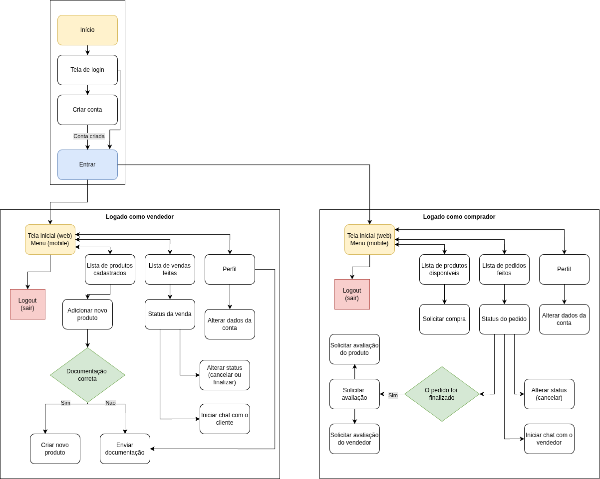

# Projeto de interface

## Diagrama de fluxo

O digrama de fluxo foi desenvolvido utilizando a suite [draw.io](https://www.drawio.com/) e está disponível abaixo (figura 1).

Figura 1 - Diagrama de fluxo do EloCampo.

## Wireframes

### Aplicação Web

Conforme discutido com o professor tutor, os wireframes foram desenvolvidos já em alta fidelidade, para auxiliar na implementação em React. Os artefatos desenvolvidos foram criados com o auxílio do Figma e estão disponíveis abaixo (figuras 2-8).

Figura 2 - Tela inicial e de cadastro do EloCampo.

Figura 3 - Tela inicial de um perfil de usuário produtor.

Figura 4 - Tela de produtos de um usuário produtor.

Figura 5 - Tela de vendas de um usuário produtor.

Figura 6 - Tela de chat de um usuário produtor.

Figura 7 - Tela inicial de um perfil de usuário comprador.

Figura 8 - Tela de solicitação de compra do usuário comprador.

### Aplicação mobile

Abaixo, as telas da aplicação mobile.

Figura 9 - Navbar de uma conta administradora.

Figura 10- Navbar de uma conta de produtor.

Figura 11 - Navbar de uma conta de comprador.

Figura 12 - Tela do administrador.

Figura 13 - Tela do comprador (1 de 2).

Figura 14 - Tela do comprador (2 de 2).

Figura 15 - Tela do produtor (1 de 2).

Figura 16 - Tela do produtor (2 de 2).

Figura 17 - Tela inicial.

