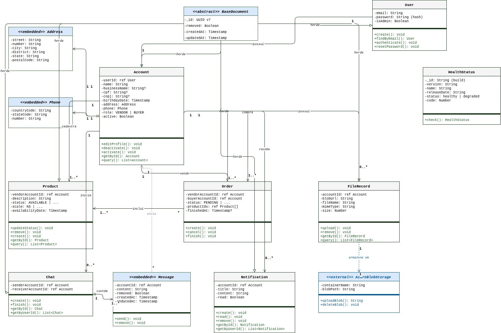
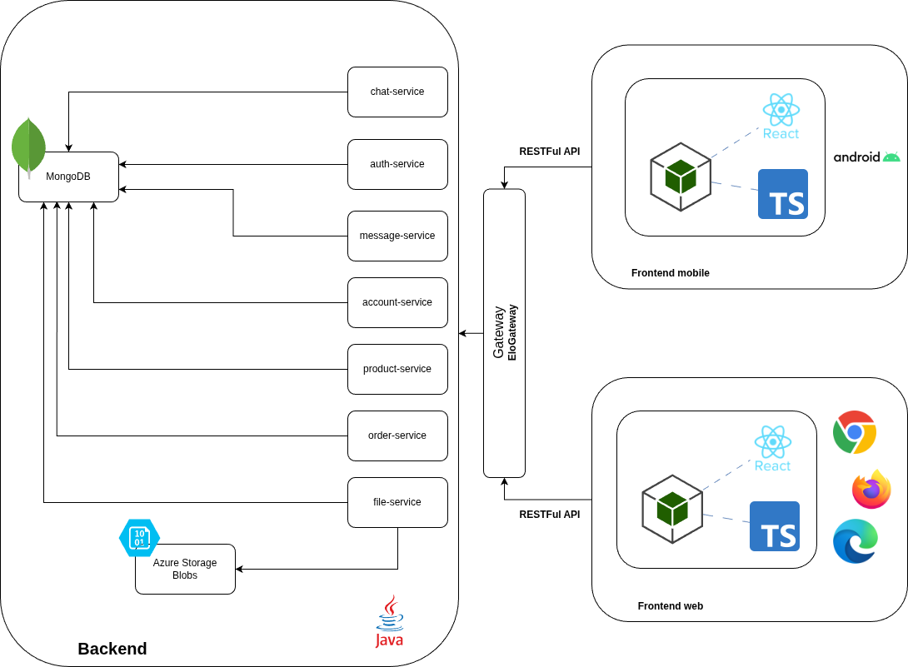

# Arquitetura da solução

<div align="justify">

## Diagrama de classes

O diagrama de classes (figura 1) ilustra graficamente como será a estrutura do software, e como cada uma das classes da sua estrutura estarão interligadas. Essas classes servem de modelo para materializar os objetos que executarão na memória.

<div align="center">



Figura 1: Diagrama de classes do EloCampo.

</div>

<hr>

## Documentação do banco de dados MongoDB

A seguir, uma descrição da estutura do banco de dados do `EloCampo`. Os dados são armazenados de forma não relacional, utilizando o `MongoDB`.

### Esquema do banco de dados

As coleções estarão representadas abaixo. Note que toda entidade na base de dados tem pelo menos um identificador, no formato (UUID v7), e timestamps de criação e última atualização. O UUID v7 será utilizado pois é ordenável cronologicamente, o que otimiza qualquer pesquisa na base de dados. Como permitir auditoria e recuperação de dados, as aplicações backend não irão realizar exclusão física de registros, apenas exclusão lógica. Para isso, toda entidade terá o atributo `removed`.

#### Coleção `user`

Esta coleção armazenará os dados de usuários cadastrados na plataforma que são utilizados para autenticação, de forma exclusiva.

```json
{
  "_id": "019342ac-1234-7000-8a1b-3f9e2d1c0b5a",
  "email": "john.doe@example.com",
  "password": "hash_da_senha",
  "isAdmin": false,
  "removed": false,
  "createdAt": 1724924400000,
  "updatedAt": 1724924400000
}
```

##### Descrição dos campos

- `_id`: identificador único do usuário, no formato UUID v7;
- `email`: email do usuário cadastrado, utilizado para comunicação com o usuário e na autenticação/login;
- `password`: hash da senha do usuário, utilizada para autenticação;
- `isAdmin`: marca se o usuário tem ou não permissão administrativa dentro da plataforma;
- `removed`: define se o usuário está ou não ativo (remoção lógica); 
- `createdAt`: timestamp da criação do objeto/entidade;
- `updatedAt`: timestamp da última atualização do objeto/entidade;

#### Coleção `account`

Esta coleção armazenará os dados das contas cadastradas na plataforma. Note que o atributo `userId` faz referência ao `_id` do usuário da coleção anterior.

Estrutura do Documento

```json
{
  "_id": "08ad8176-3f00-4a5b-9323-0ca1e3a7d90b",
  "userId": "ce6d30d3-77b0-4be3-8672-ed9bf59e6d08",
  "name": "João Neves",
  "businessName": "EloCampo LTDA",
  "cpf": "12345678901",
  "cnpj": "12345678000190",
  "birthdayDate": 1724924400000,
  "address": {
    "street": "Rua das Flores",
    "number": "123",
    "city": "Belo Horizonte",
    "district": "Centro",
    "state": "MG",
    "complement": "Apto 45",
    "postalCode": "30000-100"
  },
  "phone": {
    "countryCode": "55",
    "stateCode": "31",
    "number": "999999999"
  },
  "evaluation": [
    {
    "id": "08ad8176-3f00-4a5b-9323-0ca1e3a7d999",
    "reviewerAccountId": "019d8176-3f00-4a5b-9323-0ca1e3a7d787",
    "productId": "07ad8176-3f00-4a5b-9323-0ca1e3a7d789",
    "starts": 5,
    "content": "O produtor é excelente"
    }
  ], 
  "role": "VENDOR",
  "removed": false,
  "active": true,
  "createdAt": 1724924400000,
  "updatedAt": 1724924400000
}
```

##### Descrição dos campos

- `_id`: identificador único do usuário, no formato UUID v7;
- `userId`: identificador do usuário cadastrado na plataforma. Toda conta deve ter um `userId` correspondente;
- `name`: nome da conta;
- `businessName`: nome da empresa/organização;
- `cpf`: cadastro de pessoa física do responsável pela conta. Mutuamente exclusive com `cnpj`;
- `cnpj`: cadastro de pessoa jurídica da empresa/organização proprietária da conta. Não deve ser utilizado junto a `cpf`;
- `birthdayDate`: timestamp da data de nascimento do proprietário da conta;
- `address`: objeto composto com os dados de endereço da conta;
- `phone`: objeto composto com os dados de contato da conta;
- `evaluation`: lista que armazena avaliações da conta;
- `role`: define o tipo de conta, como vendedor (`VENDOR`) ou comprador (`BUYER`). Tipo enum;
- `removed`: define se o usuário está ou não ativo (remoção lógica); 
- `createdAt`: timestamp da criação do objeto/entidade;
- `updatedAt`: timestamp da última atualização do objeto/entidade;

#### Coleção `product`

Esta coleção armazena a lista de produtos disponibilizados por um agricultor/parte interessada.

```json
{
  "_id": "019342ac-9abc-7000-bd3e-5c7f2a4e8d1f",
  "vendorAccountId": "019342ac-5678-7000-9c2d-4a8f1e3b7d6e",
  "description": "Milho orgânico",
  "status": "AVAILABLE",
  "scale": "KG",
  "quantity": 50,
  "evaluation": [
    {
    "id": "08ad8176-3f00-4a5b-9323-0ca1e3a7d999",
    "reviewerAccountId": "019d8176-3f00-4a5b-9323-0ca1e3a7d787",
    "starts": 5,
    "content": "O produtor é excelente"
    }
  ], 
  "availabilityDate": 1724924400000,
  "removed": false,
  "createdAt": 1724924400000,
  "updatedAt": 1724924400000
}
```

##### Descrição dos campos

- `_id`: identificador único do produto, no formato UUID v7;
- `vendorAccountId`: identificador da conta do vendedor que disponibilizou o produto. Deve ter um _id correspondente na coleção account;
- `description`: descrição do produto ofertado;
- `status`: define a situação do produto, como disponível (AVAILABLE). Tipo enum;
- `scale`: define a unidade de medida do produto, como quilograma (KG). Tipo enum;
- `quantity`: define o volume disponível, considerando a escala (`scale`);
- `evaluation`: lista que armazena avaliações do produto;
- `availabilityDate`: timestamp da data em que o produto estará disponível;
- `removed`: define se o produto está ou não ativo (remoção lógica);
- `createdAt`: timestamp da criação do objeto/entidade;
- `updatedAt`: timestamp da última atualização do objeto/entidade;

#### Coleção `order`

Esta coleção armazena os pedidos criados com os produtos disponibilizados.

```json
{
  "_id": "019342ac-def0-7000-ce4f-6d8a3b5f9e2c",
  "vendorAccountId": "019342ac-5678-7000-9c2d-4a8f1e3b7d6e",
  "buyerAccountId": "2e6b797b-c781-4a8b-a8eb-89da5f6d891d",
  "status": "PENDING",
  "productIds": [
    "019342ac-9abc-7000-bd3e-5c7f2a4e8d1f",
    "019342bd-1234-7000-df5a-7e9b4c6a0f3d"
  ],
  "removed": false,
  "finishedAt": null,
  "createdAt": 1724924400000,
  "updatedAt": 1724924400000
}
```

##### Descrição dos campos

- `_id`: identificador único do pedido, no formato UUID v7;
- `vendorAccountId`: identificador da conta do vendedor responsável pelos produtos do pedido. Deve ter um _id correspondente na coleção account;
- `buyerAccountId`: identificador da conta do comprador que realizou o pedido. Deve ter um _id correspondente na coleção account;
- `status`: define a situação do pedido, como pendente (PENDING). Tipo enum;
- `productIds`: lista de identificadores dos produtos incluídos no pedido. Cada item deve ter um _id correspondente na coleção product;
- `removed`: define se o pedido está ou não ativo (remoção lógica);
- `finishedAt`: timestamp da finalização do pedido. Nulo enquanto o pedido não for concluído;
- `createdAt`: timestamp da criação do objeto/entidade;
- `updatedAt`: timestamp da última atualização do objeto/entidade;

#### Coleção `chat`

Esta coleção armazena os chats e mensagens trocadas entre o fornecedor e o comprador.

```json
{
  "_id": "019342bd-5678-7000-e06b-8f0c5d7b1a4e",
  "senderAccountId": "019342ac-5678-7000-9c2d-4a8f1e3b7d6e",
  "receiverAccountId": "019342bd-9abc-7000-f17c-9a1d6e8c2b5f",
  "messages": [
    {
      "_id": "019342bd-def0-7000-027d-0b2e7f9d3c6a",
      "accountId": "019342ac-5678-7000-9c2d-4a8f1e3b7d6e",
      "content": "Olá, o milho orgânico ainda está disponível?",
      "removed": false,
      "createdAt": 1724924400000,
      "updatedAt": 1724924400000
    }
  ],
  "removed": false,
  "createdAt": 1724924400000,
  "updatedAt": 1724924400000
}
```

##### Descrição dos campos

- `_id`: identificador único do chat, no formato UUID v7;
- `senderAccountId`: identificador da conta que iniciou o chat. Deve ter um _id correspondente na coleção account;
- `receiverAccountId`: identificador da conta que recebeu o chat. Deve ter um _id correspondente na coleção account;
- `messages`: lista de mensagens trocadas no chat. Armazenadas como documentos embutidos;
  - `_id`: identificador único da mensagem, no formato UUID v7;
  - `accountId`: identificador da conta que enviou a mensagem. Deve ter um _id correspondente na coleção account;
  - `content`: conteúdo textual da mensagem;
  - `removed`: define se a mensagem está ou não ativa (remoção lógica);
  - `createdAt`: timestamp da criação do objeto/entidade;
  - `updatedAt`: timestamp da última atualização do objeto/entidade;
- `removed`: define se o chat está ou não ativo (remoção lógica);
- `createdAt`: timestamp da criação do objeto/entidade;
- `updatedAt`: timestamp da última atualização do objeto/entidade;

#### Coleção `notification`

Esta coleção armazena as notificações geradas à partir do processamento de dados da plataforma ou em resposta à outros estímulos, como aprovação da compra, criação de conta, mensagens de aviso, etc.

```json
{
  "_id": "019342be-1234-7000-137e-1c3f8a0e4d7b",
  "accountId": "019342ac-5678-7000-9c2d-4a8f1e3b7d6e",
  "title": "Compra aprovada",
  "content": "O pedido de compra de milho orgânico foi aprovado com sucesso.",
  "read": false,
  "removed": false,
  "createdAt": 1724924400000,
  "updatedAt": 1724924400000
}
``` 

##### Descrição dos campos

- `_id`: identificador único da notificação, no formato UUID v7;
- `accountId`: identificador da conta destinatária da notificação. Deve ter um _id correspondente na coleção account;
- `title`: título da notificação;
- `content`: conteúdo textual da notificação;
- `read`: define se a notificação foi lida pelo destinatário;
- `removed`: define se a notificação está ou não ativa (remoção lógica);
- `createdAt`: timestamp da criação do objeto/entidade;
- `updatedAt`: timestamp da última atualização do objeto/entidade;

### Coleção `healthstatus`

Esta coleção é utilizada apenas para garantir que o serviço e a conexão com a base de dados estão saudáveis.

```json
{
  "_id": "abc123-build-001",
  "version": "1.0.0",
  "name": "elocampo-api",
  "releaseDate": "2026-03-29",
  "status": "healthy",
  "code": 200
}
```

##### Descrição dos campos

- `_id`: identificador único do registro de saúde, no formato de build da aplicação;
- `version`: versão atual da aplicação;
- `name`: nome da aplicação;
- `releaseDate`: data de lançamento da versão atual;
- `status`: situação atual do serviço e da conexão com a base de dados;
- `code`: código HTTP que representa o estado do serviço;

## Boas Práticas

### Validação de dados

Todos os endpoints de criação de entidades devem validar corretamente o *input* de acordo com as especificações definidas:

- Campos de texto devem sempre ter tamanho máximo, além de mínimo, quando aplicável;
- Os identificadores de correlação devem ser validados nas aplicações quando possível. Exemplo: ao criar uma conta, deve-se verificar, na aplicação de autenticação, se o `id` fornecido existe, bem como se já há conta cadastrada para este `id`;

### Padrão RESTful

Todos os endpoints expostos nas aplicações devem seguir o padrão RESTful, utilizando corretamente a semântica HTTP:

- Requisições de criação de entidades devem utilizar o verbo `POST`;
- Requisições de alteração de entidades devem utilizar o verbo `PUT`;
- Requisições de obtenção de entidade pelo `id` ou busca (*query*) devem utilizar o verbo `GET`;
- Requisições de remoção de entidades pelo `id` devem utilizar o verbo `DELETE`;

O uso correto da semântica HTTP é importante para garantir a previsibilidade das operações, bem como consistência dos dados. Por exemplo, uma requisição dos tipos `POST` e `DELETE` devem ser idempotentes, enquanto o mesmo não acontece para uma requisição `PUT`.

### Respostas padronizadas

Da mesma forma que os endpoints devem utilizar a semântica HTTP corretamente, as respostas devem ser padronizadas. As aplicações devem seguir o padrão HTTP de respostas, como por exemplo:

* HTTP `200` para operações executadas com sucesso;
* HTTP `204` quando uma remoção for feita com sucesso;
* HTTP `400` quando ocorrer erro de validação/quebra de regras de negócio/contrato;
* HTTP `401` para falha de autenticação/permissão;
* HTTP `404` para entidade não encontrada;
* HTTP `500` para erro interno do servidor.

Cada resposta também pode conter um objeto `message` com uma descrição mais detalhada do problema (útil para o frontend e debug).

### Observabilidade

As aplicações web backend devem contar com logs que permitam identificar o sucesso ou erro de operações críticas, como criação/atualização/deleção de entidades ou publicação de mensagens em tópicos do Kafka ou filas do RabbitMQ.

### Escalabilidade

As aplicações do backend distribuído devem se preocupar com a escalabilidade.

## Tecnologias utilizadas

A arquitetura da aplicação foi modelada para utilizar as seguintes tecnologias:

### Backend

Para o backend, a aplicação utiliza:

#### Linguagem de programação e frameworks da implementação

A implementação utiliza a **linguagem Java** (versão 25 LTS), junto aos frameworks que se seguem:

* **Spring Framework** com Spring Boot versão 4.0.3; 

A documentação do Spring pode ser encontrada [aqui](https://docs.spring.io/spring-framework/reference/index.html).

> Vale ressaltar que cada pacote também implementa suas próprias dependências.

#### *Integrated Development Environment* (IDE)

Foram selecionadas e validadas duas IDEs para o desenvolvimento. O **JetBrains IntelliJ** foi selecionado para o desenvolvimento em ambientes Linux e Windows. O **Visual Studio Code** foi selecionado para permitir a criação e edição de documentação e contratos Swagger. Para mais informações, leia mais sobre a justificativa de escolha de cada IDE [aqui](./03-Metodologia.md#justificativa-de-escolha-das-feramentas).

#### Docker

O **Docker** foi selecionado para virtualizar as dependências da aplicação, como a base de dados (PostgreSQL), por exemplo. Isso permite uma uniformidade entre as máquinas de todos os desenvolvedores e a hospedagem do serviço, além de permitir testes de integração que sejam seguros, não interferindo na base de dados de teste e produção. Tenha mais informações sobre a utilização do Docker no projeto [aqui](./03-Metodologia.md#docker-virtualizando-dependências), bem como a [justificativa](./03-Metodologia.md#justificativa-de-escolha-das-feramentas) de escolha da ferramenta.

#### Base de dados

O **MongoDb** foi selecionado como gerenciador de banco de dados não relacional (NoSQL) para persistir os dados na aplicação.

Além da base de dados geranciada (MongoDB), também utilizaremos o **Amazon S3** para persistir e recuperar arquivos binários, como PDFs e imagens.

#### Azure Storage Blobs

O **Azure Storage Blobs** foi utilizado para armazenar imagens de perfil de usuários e equipamentos, bem como documentos em formato PDF. Para mais informações sobre o serviço, clique [aqui](https://azure.microsoft.com/pt-br/products/storage/blobs).

### Frontend

#### Linguagem de programação e frameworks da implementação

O frontend da aplicação será desenvolvido em **React Native** para a aplicação mobile e em **React** para a aplicação web.

#### *Integrated Development Environment* (IDE)

Para o desenvolvimento, foi selecionado o **Android Studio** e o **Visual Code** como IDE e editor de código, respectivamente.

<hr>

## Comunicação entre os componentes

A **integração** entre o **backend** e o **frontend** se dá por meio de **endpoints RESTful** disponibilizados pelas aplicações do backend. Para mais informações sobre os endpoints disponibilizados, bem como os *inputs* e *outputs* esperados, leia o **contrato Swagger** que será disponibilizado futuramente.

<hr>

## Diagrama da arquitetura da aplicação

A seguir, o diagrama da arquitetura pensada para a aplicação, com todos os componentes separados em domínios (figura 2).

<div align="center">



Figura 2: Diagrama da arquitetura da aplicação, evidenciando os principais componentes do backend e do frontend da aplicação interativa.

</div>


A arquitetura foi pensada ao identificar os domínios pensados da plataforma e segregá-los em diferentes aplicações. Por questão de custo, será utilizada uma base não relacional centralizada. O ideal seria uma base de dados por domínio, garantindo a segregação dos dados.

## Configuração de ambiente e arquitetura da aplicação mobile

Este documento descreve a arquitetura, o ambiente de desenvolvimento e o fluxo de trabalho para o EloCampo.

### Arquitetura da solução

A arquitetura do projeto segue o seguinte fluxo:

#### Frontend mobile

**Frontend mobile (React Native) → API (aplicações do backend) → Banco de Dados → Serviços Externos**

- **Frontend mobile:** Aplicativo móvel desenvolvido em React Native, responsável pela interface do usuário e interação;
- **API:** Backend distribuído que centraliza as regras de negócio e a comunicação com o banco de dados;
- **Banco de Dados:** Armazena os dados das aplicações de forma não relacional;
- **Serviços Externos:** Integrações com outros serviços, se necessário;

##### Estrutura de diretórios do frontend mobile

O frontend segue a seguinte estrutura de pastas dentro de `/src`:

- **/components:** Componentes reutilizáveis da interface (botões, inputs, cards, etc);
- **/screens:** Telas completas da aplicação (Login, Home, Perfil, etc);
- **/services:** Módulos para comunicação com a API e outros serviços externos;
- **/utils:** Funções utilitárias, constantes e configurações globais;

#### Frontend web

**Frontend web (React) → API (aplicações do backend) → Banco de Dados → Serviços Externos**

- **Frontend:** Aplicação web desenvolvida em React, responsável pela interface do usuário e interação;
- **API:** Backend distribuído que centraliza as regras de negócio e a comunicação com o banco de dados;
- **Banco de Dados:** Armazena os dados das aplicações de forma não relacional;
- **Serviços Externos:** Integrações com outros serviços, se necessário;

##### Estrutura de diretórios do frontend web

A estrutura da aplicação web ainda será determinada futuramente.

## Hospedagem

As aplicações web backend estarão hospedadas no serviço Azure, da Microsoft, ou em outro serviço de cloud compatível. A aplicação frontend será acessível após deploy de forma aberta, enquanto a aplicação frontend mobile estará acessível através de um pacote APK fornecido posteriormente. 

## Plano de qualidade de software

### Plano de garantia da qualidade de software (PGQS)

> Este plano se baseia nos seguintes documentos: **ISO/IEC 25010** e **ISO/IEC 9001**.

**Objetivo**: definir critérios e processos para assegurar a qualidade do software, tanto do backend quanto do aplicação React Native.

**Conteúdo**:

* Política de qualidade: validação junto ao PO das funcionalidades desenvolvidas;
* Critérios de aceitação: atenção ao cumprimento dos critérios de aceite propostos;
* Procedimentos de revisão de código: revisão pelos pares com pelo menos uma aprovação de PR;
* Testes automatizados e manuais: preferência pelo desenvolvimento de testes unitários e de integração, além dos manuais;
* Gestão de configuração;
* Controle de versão usando `git`;
* Processo de build e deploy: aplicação web backend (Java; Azure) e aplicação mobile (Reactive Native, APK).

### Plano de gerenciamento de configuração

> Este plano se baseia na **ISO/IEC 10007**.

**Objetivo**: definir como versões, branches e builds são gerenciados.

**Conteúdo**:

A ferramenta de controle de versão adotada no projeto foi o [Git](https://git-scm.com/), sendo que o [Github](https://github.com)
foi utilizado para hospedagem do repositório.

O projeto segue a seguinte convenção para o nome de branches:

- **main** : Branch principal, contém o código de produção (estável).
- **develop**: Branch de desenvolvimento, onde as novas features são integradas.
- **feature/nome-da-feature**: Branches criadas a partir de `develop` para desenvolver novas funcionalidades.

Quanto à gerência de issues, o projeto adota a seguinte convenção para
etiquetas:

- `documentation`: melhorias ou acréscimos à documentação;
- `bug`: uma funcionalidade encontra-se com problemas;
- `enhancement`: uma funcionalidade precisa ser melhorada;
- `feature`: uma nova funcionalidade precisa ser introduzida.

#### Fluxo de trabalho

1.  A partir da branch `develop`, crie uma nova branch de feature:
    ```bash
    git checkout develop
    git pull
    git checkout -b feature/sua-nova-feature
    ```
2.  Faça suas alterações e commits na branch de feature;
3.  Ao concluir, envie sua branch para o repositório remoto:
    ```bash
    git push origin feature/sua-nova-feature
    ```
4.  Abra um **Pull Request (PR)** no GitHub, da sua branch de feature para a `develop`;
5.  Após a revisão e aprovação do PR, ele será mesclado à `develop`.

### Plano de Segurança da Informação

> Este plano se baseia na na **ISO/IEC 27001**.

**Objetivo**: garantir que dados de usuários e autenticação estejam protegidos.

Conteúdo:

* Persistência de hash seguro de senhas (não persistência de senhas em formato texto puro);
* Política de senhas e autenticação: necessidade de autenticação para utilização da plataforma;
* Recuperação de senha por e-mail (com token temporário ou senha temporária);
* Criptografia de dados sensíveis;
* Políticas de acesso e logs de auditoria (backend, via Azure).

### Plano de testes de software

> Este plano se baseia na ISO/IEC/IEEE 29119.

**Objetivo**: planejar e executar testes que validem os requisitos funcionais e não funcionais.

**Conteúdo**:

* Tipos de testes (unitário, integração, aceitação, usabilidade, desempenho);
* Estratégia de testes automatizados no backend (xUnit/NUnit) caso possível;
* Testes de interface no React Native (Jest/Testing Library) caso possível;
* Registro e rastreabilidade dos resultados ([Registro de Testes de Software](./09-Registro%20de%20Testes%20de%20Software.md) e [Registro de Testes de Usuabilidade](./11-Registro%20de%20Testes%20de%20Usabilidade.md));
* Critérios de aprovação (normalmente disponíveis em cada card no board Kanban do projeto).

### Relatório de avaliação de qualidade

> Este relatório se baseia na **ISO/IEC 25040**.

**Objetivo**: avaliar a qualidade final do produto desenvolvido, conforme atributos da ISO 25010.

**Conteúdo**:

* Funcionalidade;
* Confiabilidade;
* Usabilidade;
* Eficiência de desempenho;
* Segurança;
* Compatibilidade;
* Manutenibilidade;
* Portabilidade.

### Plano de desenvolvimento e entregas (Scrum)

Este plano se baseia no **Guia Scrum** (2020).

**Conteúdo**:

* Papéis (Product Owner, Scrum Master, Dev Team): definições disponíveis [neste](./03-Metodologia.md) documento, na seção de `Gestão do Projeto`;
* Artefatos (Product Backlog, Sprint Backlog, incremento);
* Reuniões (Planning, Daily, Review, Retrospectiva);
* Cronograma das Sprints (disponível no quadro Kanban do projeto);
* Ferramentas de apoio: GitHub Projects, Microsoft Teams, Google Meet, WhatsApp.

### Plano de manutenção e evolução

> Este plano se baseia na na ISO/IEC 14764.

**Objetivo**: definir estratégias de manutenção corretiva, adaptativa e evolutiva.

**Conteúdo**:

* Documentação de novas features;
* Planejamento de releases futuras.

</div>
