# Template padrão da aplicação

## Aplicação Web

### Tecnologias de interface

O frontend da aplicação é desenvolvido em **React 18** com **TypeScript**, utilizando **React Router 6** para navegação entre páginas. A estilização é feita com **CSS puro** (sem frameworks como Tailwind ou Material-UI), por meio de um único arquivo de variáveis globais (`index.css`) combinado com estilos *inline* nos componentes TSX.

### Logotipo

O logotipo desenvolvido para a aplicação pode ser encontrado abaixo (figura 1).

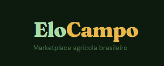

Figura 1 - Logotipo do EloCampo.

### Fonte

A aplicação utiliza três famílias tipográficas, todas carregadas via **Google Fonts**:

| Variável CSS   | Família            | Classificação | Pesos         | Uso principal |
|:--------------:|:------------------:|:-------------:|:-------------:|:-------------:|
| `--font-serif` | **Fraunces**       | Serifada      | 400, 700, 900 | Logotipo, títulos e valores numéricos de destaque |
| `--font-sans`  | **DM Sans**        | Sem serifa    | 400, 500, 600 | Corpo do texto, rótulos e elementos de interface |
| `--font-mono`  | **JetBrains Mono** | Monoespaçada  | 400, 500      | Valores técnicos e identificadores |

### Paleta de cores

A aplicação adota o **modo escuro** de forma exclusiva — não há suporte a modo claro. Para diferenciar claramente os dois perfis de usuário, são utilizados dois esquemas cromáticos distintos: **verde** para o **produtor** e **azul** para o **comprador**. Há ainda cores neutras e cores de estado partilhadas entre ambos os perfis.

#### Esquema do produtor (Verde)

| Variável | Hex | Uso |
|:--------:|:---:|:---:|
| `--g900` | `#0b1f0c` | Fundo da barra lateral |
| `--g800` | `#122114` | Hover na navegação lateral |
| `--g700` | `#1b341d` | Bordas e divisores sutis |
| `--g600` | `#264d29` | Estado selecionado de elementos de seleção |
| `--g500` | `#2f6433` | Botão primário |
| `--g400` | `#4a9050` | Hover do botão primário; foco em campos de formulário |
| `--g300` | `#6dbf74` | Cor de destaque e acentuação |
| `--g200` | `#a8dca9` | Texto sobre fundos escuros; itens ativos na navegação |
| `--g100` | `#d4f0d5` | Texto do botão primário |

#### Esquema do comprador (Azul)

| Variável         | Hex | Uso |
|:----------------:|:---:|:---:|
| `--buyer-bg`     | `#060e14` | Fundo principal |
| `--buyer-card`   | `#0a1520` | Fundo de cartões e painéis |
| `--buyer-border` | `#1a3050` | Bordas |
| `--sky`          | `#2a6b8a` | Botão primário do comprador |
| `--sky-l`        | `#70aadd` | Cor de destaque; texto e itens ativos |
| `--sky-d`        | `#1a4a6a` | Acentuação escura |

#### Cores neutras (compartilhadas)

| Variável   | Hex       | Uso |
|:----------:|:---------:|:---:|
| `--bg`     | `#0d1a0e` | Fundo base da aplicação |
| `--bg2`    | `#111f12` | Fundo da área principal (produtor) |
| `--bg3`    | `#162618` | Fundo de painéis e seções |
| `--card`   | `#1a2e1c` | Fundo de cartões (produtor) |
| `--border` | `#2a4a2c` | Bordas gerais (produtor) |
| `--text`   | `#e8f5e9` | Texto primário |
| `--text2`  | `#a8c5aa` | Texto secundário |
| `--text3`  | `#6a9a6c` | Texto terciário / silenciado (produtor) |
| `--text4`  | `#3d6b3f` | Texto muito silenciado |
| `--gold`   | `#e8b84b` | Cor de acento dourada (logo, destaques) |
| `--gold-l` | `#f5d47a` | Dourado claro |
| `--gold-d` | `#b8882b` | Dourado escuro |

#### Cores de estado

| Cor            | Hex                       | Uso |
|:--------------:|:-------------------------:|:---:|
| Vermelho       | `#e07070`                 | Alertas de erro; botão de logout |
| Vermelho fundo | `rgba(224,112,112,0.1)` | Fundo de alertas de erro |
| Verde fundo    | `rgba(74,144,80,0.1)`   | Fundo de alertas de sucesso |

### Comparativo entre perfis

A tabela abaixo resume as diferenças visuais entre os dois perfis de usuário:

| Elemento             | Produtor              | Comprador |
|:--------------------:|:---------------------:|:---------:|
| Fundo principal      | `#0d1a0e` / `#111f12` | `#060e14` |
| Fundo de cartão      | `#1a2e1c`             | `#0a1520` |
| Cor de borda         | `#2a4a2c`             | `#1a3050` |
| Botão primário       | `#2f6433` (verde)     | `#2a6b8a` (azul) |
| Hover do botão       | `#4a9050`             | `#3a7b9a` |
| Texto do botão       | `#d4f0d5`             | `#e0f0ff` |
| Cor de destaque      | `#6dbf74` (verde)     | `#70aadd` (azul) |
| Texto silenciado     | `#6a9a6c`             | `#4a7090` |
| Fundo da sidebar     | `#0b1f0c`             | `#050d14` |
| Itens ativos sidebar | `#a8dca9`             | `#70aadd` |

### Iconografia

A interface utiliza **emojis Unicode** como ícones de navegação e ação, dispensando o uso de bibliotecas de ícones externas. Os emojis são aplicados nos itens de menu da barra lateral, nos estados vazios de listas e em elementos de destaque visual.

### Componentes de interface

#### Estrutura de layout

A aplicação adota um layout de **painel lateral fixo** (*sidebar* + área de conteúdo principal):

- **Barra lateral (`sidebar`):** largura fixa de `220px`, fundo escuro, navegação vertical com ícones e rótulos.
- **Área principal (`main-content`):** ocupa o restante da largura; inclui uma **barra superior (*topbar*)** fixa com título da página e ações contextuais, e um corpo (`page-body`) com padding de `22px 26px`.

#### Cartões

Cartões são o principal elemento de agrupamento de informação. Possuem `18px` de padding interno, bordas de `1px`, raio de `12px` (`--radius`) e fundo ligeiramente mais claro que o fundo da página. O modificador `.buyer` aplica as cores do esquema azul.

#### Botões

| Classe       | Estilo                       | Uso |
|:------------:|:----------------------------:|:---:|
| `.btn-prim`  | Verde `#2f6433`, texto claro | Ação principal — Produtor |
| `.btn-buyer` | Azul `#2a6b8a`, texto claro  | Ação principal — Comprador |
| `.btn-ghost` | Transparente, borda sutil    | Ações secundárias |
| `.btn-sm`    | Padding `5px 10px`           | Ações compactas |
| `.btn-lg`    | Padding `11px 22px`          | Ações de destaque |

#### *Tags* de estado

| Classe       | Cor      | Uso |
|:------------:|:--------:|:---:|
| `.tag-green` | Verde    | Disponível / ativo |
| `.tag-blue`  | Azul     | Perfil comprador / destaque |
| `.tag-gold`  | Dourado  | Peso / escala |
| `.tag-red`   | Vermelho | Indisponível / erro |

#### Formulários

Campos de formulário seguem o mesmo esquema cromático do perfil: fundos escuros (`#111f12` no produtor, `#0a1520` no comprador), bordas de `0.5px`, raio de `6px` e texto colorido conforme o perfil. Ao receber foco, a borda muda para `var(--g400)` (verde) ou equivalente azul.

#### Estatísticas

Blocos de estatística utilizam uma grade de quatro colunas (`.stat-grid`). Os valores numéricos são renderizados com a fonte **Fraunces** em `26px`, enquanto os rótulos usam **DM Sans** em `10px` com letras maiúsculas e espaçamento de `0.06em`.

---

### Interface padronizada

As interfaces tiveram seus leiautes padronizados durante o desenvolvimento dos wireframes. Os artefatos desenvolvidos foram criados com o auxílio do Figma e estão disponíveis abaixo (figuras 2-17).

#### Aplicação web

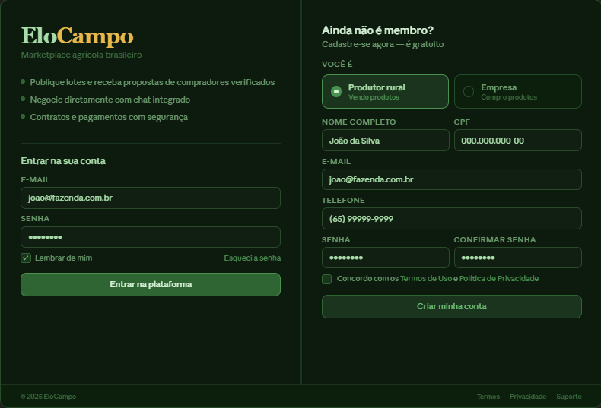

Figura 2 - Tela inicial e de cadastro do EloCampo.

Figura 3 - Tela inicial de um perfil de usuário produtor.

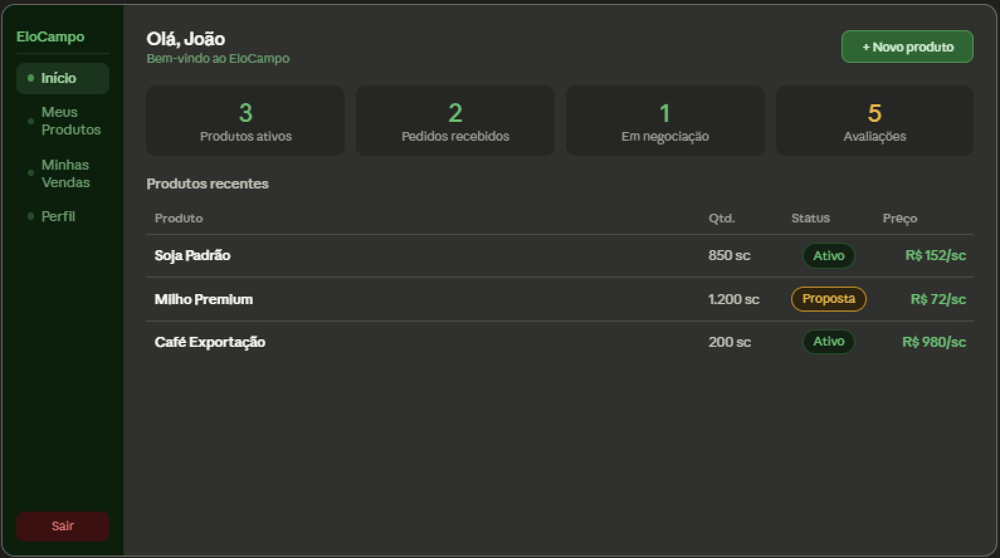

Figura 4 - Tela de produtos de um usuário produtor.

Figura 5 - Tela de vendas de um usuário produtor.

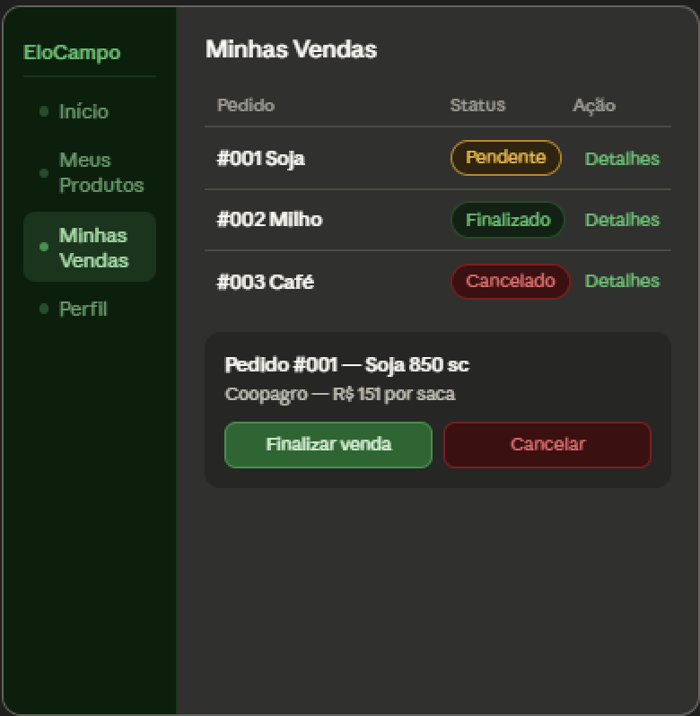

Figura 6 - Tela de chat de um usuário produtor.

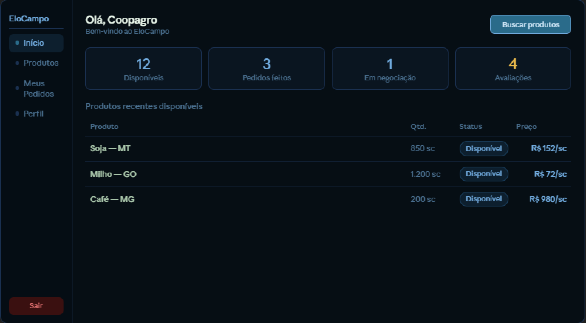

Figura 7 - Tela inicial de um perfil de usuário comprador.

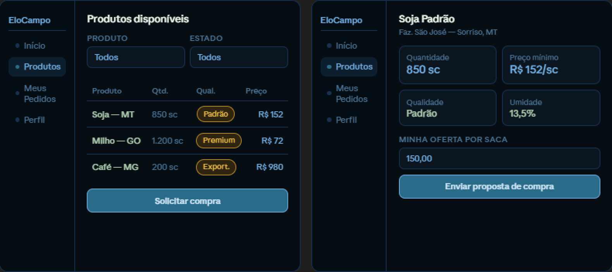

Figura 8 - Tela de solicitação de compra do usuário comprador.

#### Aplicação mobile

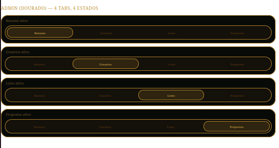

Figura 9 - Navbar de uma conta administradora.

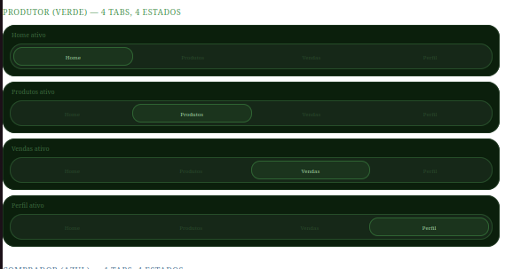

Figura 10- Navbar de uma conta de produtor.

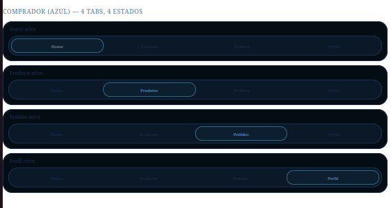

Figura 11 - Navbar de uma conta de comprador.

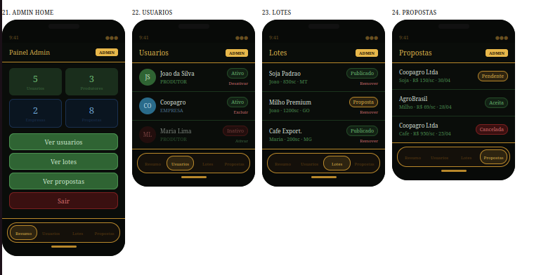

Figura 12 - Tela do administrador.

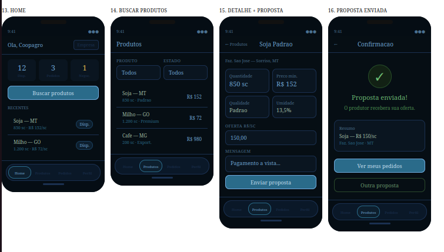

Figura 13 - Tela do comprador (1 de 2).

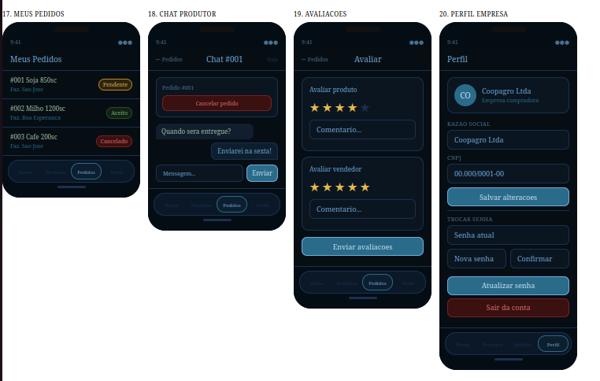

Figura 14 - Tela do comprador (2 de 2).

Figura 15 - Tela do produtor (1 de 2).

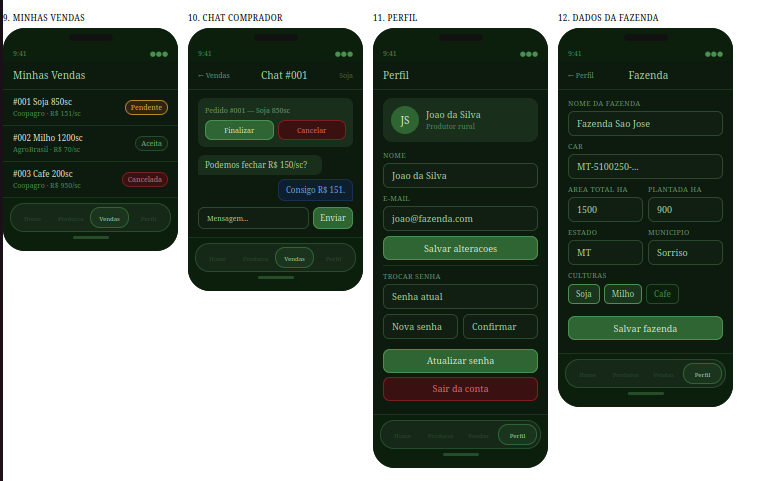

Figura 16 - Tela do produtor (2 de 2).

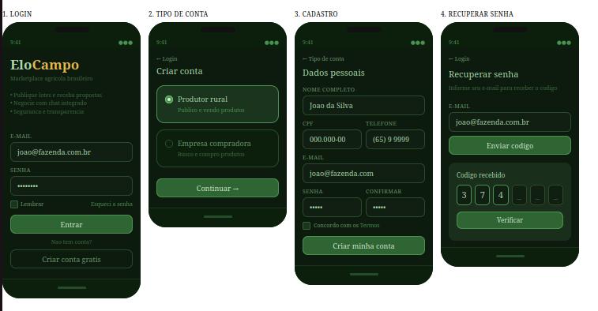

Figura 17 - Tela inicial.

