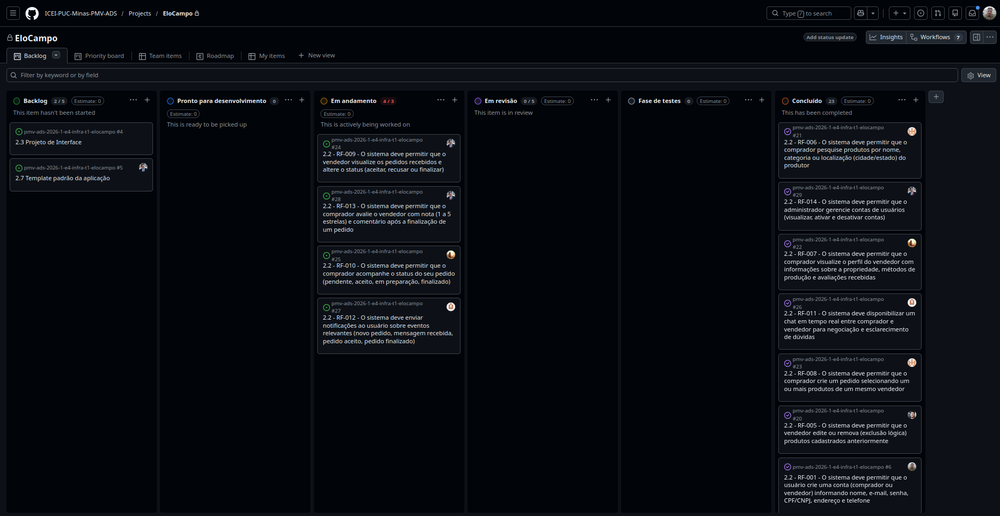
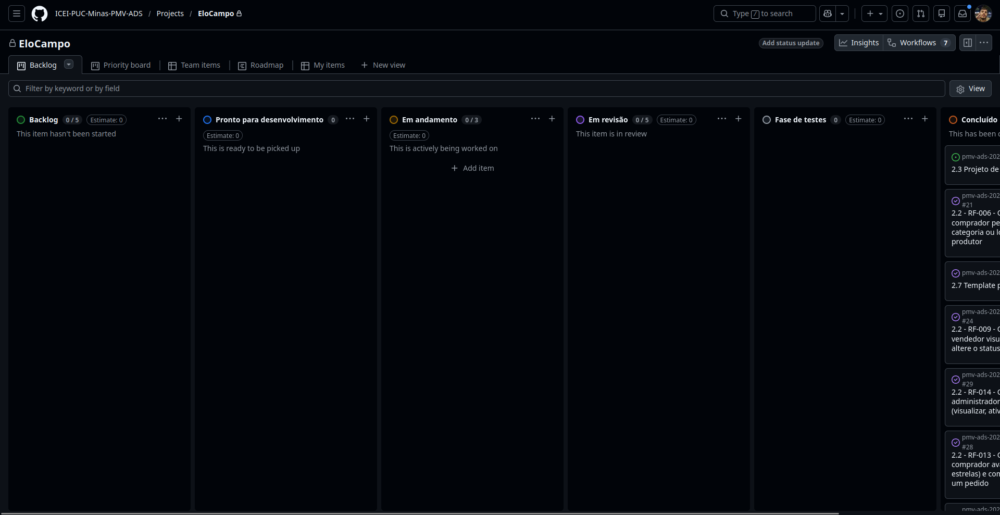

# Documentação do projeto de trabalho em equipe

## Visão geral

Este documento detalha as etapas e responsabilidades do trabalho em equipe para o desenvolvimento de um projeto. O projeto está dividido em cinco etapas principais, cada uma com suas respectivas tarefas e prazos. Cada membro da equipe é responsável por completar as tarefas atribuídas e colaborar com os demais para garantir o sucesso do projeto.

## Etapa 1: Levantamento

### Objetivo

Coletar e documentar todos os requisitos necessários para o desenvolvimento do projeto.

### Tarefas

- **Reunião com stakeholders**: Realizar reuniões com as partes interessadas para entender as necessidades e expectativas;
- **Levantamento de requisitos**: Documentar os requisitos funcionais e não funcionais do projeto;
- **Análise de viabilidade**: Avaliar a viabilidade técnica e econômica do projeto.

### Responsáveis

- **Analista de requisitos**: 
  - Bruno Figueiredo;
  - Diovane Marcelino Azevedo;
  - Felipe Miguel Nery Lunkes;
  - João Paulo Fernandes Salviano;
  - Levi Alves;
  - Lucas Hermógenes do Nascimento.
- **Gerente de projeto**: João Paulo Fernandes Salviano;
- **Arquiteto da solução**: Felipe Miguel Nery Lunkes;

### Prazo

- **Data de conclusão**: 2026-03-06

---

## Etapa 2: Desenvolvimento do Back-end: Web API

### Objetivo

Desenvolver os microsserviços necessários para cumprir os requisitos funcionais e não funcionais

### Tarefas

- **Desenvolvimento da API**: Implementar as APIs necessárias para o funcionamento do sistema;
- **Gestão de Banco de Dados**: Projetar e implementar o banco de dados;
- **Testes Unitários**: Criar e executar testes unitários para garantir a qualidade do código backend.

### Responsáveis

- **Desenvolvedores de software**: 
  - Bruno Figueiredo;
  - Diovane Marcelino Azevedo;
  - Felipe Miguel Nery Lunkes;
  - João Paulo Fernandes Salviano;
  - Levi Alves;
  - Lucas Hermógenes do Nascimento.
- **Gerente de projeto**: João Paulo Fernandes Salviano;
- **Arquiteto da solução**: Felipe Miguel Nery Lunkes;

### Prazo

- **Data de conclusão**: 2026-04-12

### GitHub Projects

Abaixo, uma imagem do board atual com as tarefas da etapa.

### Contribuição individual

| Membro | Artefatos principais e requisitos | Resumo da contribuição |
|:------:|:------------------------------:|:----------------------:|
| **Felipe Miguel Nery Lunkes** | `auth-service`, `account-service`, `message-service`, `elogateway` (RF-001, RF-002, RF-003 e RF-009) | Desenvolveu integralmente o serviço de autenticação JWT (`auth-service`), o serviço de contas (`account-service`) com criação, ativação/desativação e testes unitários, e o serviço de envio de emails (`message-service`). Configurou o gateway (`elogateway`) e realizou integrações entre serviços (comunicação via Feign Client). Também realizou refatorações e correções no `order-service` e `product-service`. |
| **Diovane Marcelino Azevedo** | `order-service` e `product-service` (RF-006, RF-008, RF-010) | Desenvolveu o `order-service` (contrato, implementação, entidades), implementou os endpoints de pedidos (RF-006 e RF-008) com tratamento de erros, e adicionou a rota de listagem de produtos ao `product-service`. Também escreveu testes unitários para o `order-service` e para o `product-service`, além de organizar coleções Postman. |
| **Lucas Hermógenes do Nascimento** | `chat-service` (RF-011 e RF-012) | Desenvolveu o serviço de chat (`chat-service`), incluindo contrato, implementação, entidades (`Chat`, `Message`), mapeamento, repositório, configurações de segurança e testes. |
| **João Paulo Fernandes Salviano** | `file-service` e `product-service` (RF-004 e RF-005) | Desenvolveu integralmente o `file-service` (upload de arquivos associados a produto ou perfil). Implementou funcionalidades do `product-service` (RF-004 e RF-005). Corrigiu bugs no `chat-service` (deserialização e lógica invertida) e no `auth-service` (configuração do JWT), além de realizar correções no `account-service` e contribuir com testes e documentação. |
| **Levi Alves** | `product-service` e `account-service` (RF-007 e RF-013, features de avaliação) | Implementou o endpoint de avaliação de produtos e de contas para atender o RF-013, tanto no `product-service` quanto no `account-service`, incluindo contrato (DTOs) e lógica de serviço. |
| **Bruno Figueiredo** | — | Nesta etapa, não registramos commits para o Bruno. O motivo já foi reportado ao professor. Seus requisitos foram redistrubuídos entre os outros integrantes. |

---

## Etapa 3: Desenvolvimento da aplicação Web

### Objetivo

Desenvolver a aplicação Web frontend, integrando o backend em uma interface simples de usar e intuitiva.

### Tarefas

- **Desenvolvimento Web frontend**: Criar a interface de usuário utilizando as tecnologias web escolhidas (React);
- **Integração com Backend**: Integrar o frontend com as APIs desenvolvidas na etapa anterior;
- **Testes de Interface**: Realizar testes de usabilidade e interface para assegurar a qualidade da aplicação web;
- **Correções de erros no backend**: Realizar a correção de erros e implementar os endpoints necessários para esta etapa, que não haviam sido levantados.

### Responsáveis

- **Desenvolvedores de software**: 
  - Bruno Figueiredo;
  - Diovane Marcelino Azevedo;
  - Felipe Miguel Nery Lunkes;
  - João Paulo Fernandes Salviano;
  - Levi Alves;
  - Lucas Hermógenes do Nascimento.
- **Gerente de projeto**: João Paulo Fernandes Salviano;
- **Arquiteto da solução**: Felipe Miguel Nery Lunkes;

### Prazo

- **Data de conclusão**: 2026-05-10

### GitHub Projects

Abaixo, uma imagem do board atual com as tarefas da etapa.

### Contribuição individual

| Membro | Artefatos principais e requisitos | Resumo da contribuição |
|:------:|:------------------------------:|:----------------------:|
| **Felipe Miguel Nery Lunkes** | `Login.tsx`, `Cadastro.tsx`, `AuthContext.tsx`, `Sidebar.tsx`, `App.tsx`, `PerfilEmpresa.tsx`, `PerfilProdutor.tsx`, `MinhasVendas.tsx`, testes unitários (RF-001, RF-002 e RF-003) | Realizou a configuração inicial do projeto frontend (Vite, package.json, estrutura de pastas). Implementou o contexto de autenticação (`AuthContext.tsx`), o layout principal (`App.tsx`, `Sidebar.tsx`) e as páginas de autenticação (`Login.tsx`, `Cadastro.tsx`). Desenvolveu as páginas de perfil do comprador (`PerfilEmpresa.tsx`) e do produtor (`PerfilProdutor.tsx`). Realizou melhorias na página de vendas (`MinhasVendas.tsx`) e corrigiu o acesso de usuário admin. Escreveu testes unitários abrangentes para autenticação, contexto, serviços, utilitários JWT e componentes de layout, além de documentar os testes no README. Também escreveu a documentação da aplicação, alterou/revisou a documentação geral do projeto e fez correção de bug e implementação de novos endpoints no backend Java. Ficou responsável pela entrega na etapa. |
| **Diovane Marcelino Azevedo** | `BuscarProdutos.tsx`, `MeusPedidos.tsx`, `MinhasVendas.tsx`, testes unitários (RF-006, RF-008 e RF-010) | Desenvolveu e manteve as páginas de busca de produtos (`BuscarProdutos.tsx`), pedidos do comprador (`MeusPedidos.tsx`) e vendas do produtor (`MinhasVendas.tsx`). Corrigiu a exibição da descrição dos produtos nas listas de pedidos e a finalização de venda. Ajustou a estilização das tabelas de produtos. Escreveu testes unitários para as três páginas sob sua responsabilidade. |
| **Lucas Hermógenes do Nascimento** | `DashboardProdutor.tsx` e `DashboardComprador.tsx` (RF-011 e RF-012) | Foi responsável pelo desenvolvimento da tela de chat da aplicação e das notificações.  |
| **João Paulo Fernandes Salviano** | `AdminDashboard.tsx`, `MeusProdutos.tsx`, `services/api.ts`, `types/index.ts`, testes unitários (RF-004 e RF-005) | Desenvolveu a página de administração (`AdminDashboard.tsx`) com gráficos de barras (biblioteca recharts), granularidade adaptativa e filtros de relatório. Criou a página de gerenciamento de produtos do produtor (`MeusProdutos.tsx`). Atualizou `services/api.ts` (adicionando o endpoint `buscarTodasContas`) e centralizou labels em `types/index.ts`. Escreveu testes unitários para `AdminDashboard` e `MeusProdutos`. |
| **Levi Alves** | `DashboardComprador.tsx`, `DashboardProdutor.tsx`, testes unitários (RF-007 e RF-013) | Desenvolveu os dashboards do comprador (`DashboardComprador.tsx`) e do produtor (`DashboardProdutor.tsx`), ambos integrados ao  `product-service` para exibição de avaliações. Escreveu os testes unitários correspondentes para ambos os dashboards. |
| **Bruno Figueiredo** | Arquivos base iniciais, `AdminDasboard.tsx` e participação em `DashboardProdutor.tsx` e `DashboardComprador.tsx` (RF-009 e RF-014)| Realizou o upload inicial dos arquivos base do frontend (`App.tsx`, `Login.tsx`, `Cadastro.tsx`, `Sidebar.tsx`, `AuthContext.tsx`, `main.tsx`, `index.css`), que serviram como ponto de partida para o desenvolvimento da aplicação. Participou do desenvolvimento dos dashboards de comprador e produtor e do dashboard de administrador. |

---

## Etapa 4: Desenvolvimento da aplicação Mobile

### Objetivo

Desenvolver a aplicação mobile do projeto utilizando React Native (Expo), integrando o backend já desenvolvido em uma interface adaptada para dispositivos móveis.

### Tarefas

- **Desenvolvimento Mobile**: Implementar a versão mobile do projeto para Android com React Native + Expo;
- **Integração com backend**: Garantir que a aplicação mobile se comunique corretamente com os microsserviços via gateway;
- **Testes Unitários**: Criar e executar testes unitários para componentes, contextos, navegação, serviços e telas.

### Responsáveis

- **Desenvolvedores de software**: 
  - Bruno Figueiredo;
  - Diovane Marcelino Azevedo;
  - Felipe Miguel Nery Lunkes;
  - João Paulo Fernandes Salviano;
  - Levi Alves;
  - Lucas Hermógenes do Nascimento.
- **Gerente de projeto**: João Paulo Fernandes Salviano;
- **Arquiteto da solução**: Felipe Miguel Nery Lunkes;

### Prazo

- **Data de conclusão**: 2026-05-31

### Contribuição individual

| Membro | Artefatos principais e requisitos | Resumo da contribuição |
|:------:|:------------------------------:|:----------------------:|
| **Felipe Miguel Nery Lunkes** | Esqueleto da aplicação, telas de autenticação, `HomeProdutorScreen`, `PropostasRecebidasScreen`, `HomeCompradorScreen`, testes unitários (RF-001, RF-002 e RF-003) e provisionamento do backend na Azure e frontend Web no Render, além da construição da aplicação mobile (APK para sistema operacional Android) | Criou o esqueleto completo da aplicação mobile (componentes `Btn`, `Input`, `Tag`, `CustomTabBar`; `AuthContext`; todas as stacks e tabs de navegação; `services/api.ts`; `types/index.ts`; `utils/masks.ts`; `theme/colors.ts`; `config.ts`). Implementou integralmente as cinco telas de autenticação (`LoginScreen`, `CadastroInicialScreen`, `TipoContaScreen`, `CadastroScreen`, `RecuperarSenhaScreen`), a home do produtor (`HomeProdutorScreen`) e a tela de propostas recebidas (`PropostasRecebidasScreen`). Entregou a versão final da `HomeCompradorScreen`. Escreveu 13 suítes de testes cobrindo componentes, contexto, navegação, serviço de API, constantes, utilitários de máscara e todas as telas de autenticação. Realizou também a correção de testes da tela de admin e adicionou o status `CANCELLED` de pedido no backend. Realizou a configuração e deploy do backend na conta da Azure do João Paulo Fernandes Salviano, além da configuração e deploy do frontend Web no Render. Ficou responsável pela construção do APK e pela entrega da etapa. |
| **Diovane Marcelino Azevedo** | `BuscarProdutosScreen`, `MeusPedidosScreen`, `PropostaEnviadaScreen` e respectivos testes (RF-006, RF-008 e RF-010) | Desenvolveu as três telas do fluxo de compra: busca de produtos com filtros por estado/UF (`BuscarProdutosScreen`), listagem e acompanhamento de pedidos com navegação por status (`MeusPedidosScreen`) e tela de confirmação de proposta enviada (`PropostaEnviadaScreen`). Escreveu os testes unitários correspondentes para as três telas. |
| **Lucas Hermógenes do Nascimento** | `ChatDetailScreen`, `ChatsListScreen`, `ChatCompradorScreen`, `PerfilProdutorScreen` e respectivos testes (RF-011 e RF-012) | Implementou o fluxo de chat da aplicação mobile: lista de conversas com preview da última mensagem (`ChatsListScreen`), tela de chat com envio de mensagens em tempo real (`ChatDetailScreen`) e tela de acesso ao chat a partir de um pedido pendente (`ChatCompradorScreen`). Desenvolveu também a tela de perfil do produtor (`PerfilProdutorScreen`) com edição de dados, máscaras de CPF/CNPJ/CEP, avatar com iniciais e upload de foto. Escreveu os testes unitários para todas as quatro telas. |
| **João Paulo Fernandes Salviano** | `AdminHomeScreen`, `PedidosAdminScreen`, `ProdutosAdminScreen`, `UsuariosAdminScreen`, `DetalheProdutoScreen`, `MeusProdutosScreen`, `NovoProdutoScreen` e respectivos testes (RF-004, RF-005 e RF-014) | Desenvolveu o painel administrativo completo (home com estatísticas, listagem de pedidos, listagem e remoção de produtos, gerenciamento de usuários com ativação/desativação). Implementou as telas do produtor para gerenciamento de produtos (`MeusProdutosScreen`, `NovoProdutoScreen`) e a tela de detalhe de produto para o comprador (`DetalheProdutoScreen`) com envio de proposta/pedido. Escreveu os testes unitários para todas as seis telas sob sua responsabilidade. |
| **Levi Alves** | `AvaliacoesScreen` e respectivo teste (RF-007 e RF-013) | Desenvolveu a tela de avaliações pós-compra (`AvaliacoesScreen`), permitindo ao comprador avaliar o produto e o vendedor com estrelas (1–5) após a conclusão de um pedido. Realizou a correção de bugs na tela após revisão. Escreveu o teste unitário correspondente. |
| **Bruno Figueiredo** | `PerfilCompradorScreen`, `MinhasVendasScreen`, `DetalheVendaScreen` e respectivos testes (RF-009) | Implementou o fluxo de gestão de vendas do produtor: listagem das vendas recebidas (`MinhasVendasScreen`) e tela de detalhe de venda com ações de aceitar, recusar (com modal de confirmação) e finalizar pedido (`DetalheVendaScreen`). Desenvolveu também a tela de perfil do comprador (`PerfilCompradorScreen`) com edição de dados pessoais, endereço e avatar. Escreveu os testes unitários para as três telas. |

---

## Etapa 5: Homologação e apresentação da solução produzida

### Objetivo

Garantir que a solução desenvolvida esteja pronta para produção e apresentar o projeto às partes interessadas.

### Tarefas

- **Homologação**: Realizar testes finais com os stakeholders para validar a solução;
- **Correção de bugs**: Corrigir quaisquer problemas encontrados durante a homologação;
- **Apresentação final**: Preparar e conduzir a apresentação da solução final para os stakeholders.

### Responsáveis

A apresentação final, que ocorreu no dia 08/06/2026, foi conduzida por Felipe Lunkes e João Paulo Salviano.

- **Desenvolvedores de software**: 
  - Bruno Figueiredo;
  - Diovane Marcelino Azevedo;
  - Felipe Miguel Nery Lunkes (conduziu a aparesentação da solução);
  - João Paulo Fernandes Salviano (conduziu a apresentação da solução);
  - Levi Alves;
  - Lucas Hermógenes do Nascimento.
- **Gerente de projeto**: João Paulo Fernandes Salviano;
- **Arquiteto da solução**: Felipe Miguel Nery Lunkes;

### Prazo

- **Data de conclusão**: 2026-06-08

### Contribuição individual

| Membro | Artefatos principais e requisitos | Resumo da contribuição |
|:------:|:------------------------------:|:----------------------:|
| **Felipe Miguel Nery Lunkes** | Construição da aplicação mobile (APK para sistema operacional Android) e testes finais de aceitação | Gerou o pacote APK final e participou dos testes de aceitação. Ficou responsável pela apresentação da solução e pela entrega da etapa. |
| **João Paulo Fernandes Salviano** | Testes finais de aceitação | Ficou responsável pela apresentação da solução. |

---

## Comunicação e Colaboração

### Ferramentas de comunicação

- **WhatsApp**: comunicação diária e rápida, de forma assíncrona;
- **Microsoft Teams**: comunicação síncrona;
- **GitHub Projects**: gerenciamento de tarefas e acompanhamento do progresso;
- **GitHub**: versionamento de código e revisão de pull requests;

### Reuniões regulares

- **Reunião semanal**: toda segunda-feira às 19 horas;
- **Reunião de alinhamento**: toda quarta-feira, às 19 horas;
- **Reunião de revisão**: ao final de cada etapa para revisar o progresso e ajustar o plano;

---

